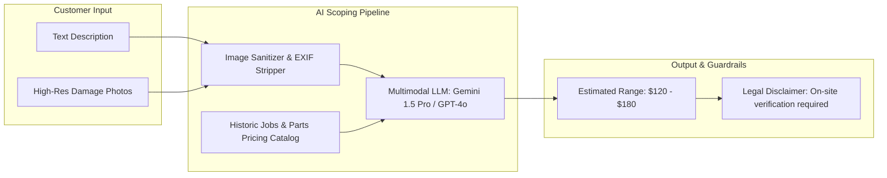

# AI Price Estimation and Recommendations — SkillConnect

| Document Attribute | Details |
| :--- | :--- |
| **Document ID** | `DOC-ARCH-010` |
| **Status** | Proposed (Target: Phase 6) |
| **Owner** | Lead AI Architect & Data Scientist |
| **Target Audience** | Machine Learning Engineers, Backend Developers, Legal Counsel |
| **Last Updated** | October 2026 |

---

## 1. Objective and Architectural Positioning

The SkillConnect AI Price Estimation Engine is an **advisory scoping tool** designed to alleviate consumer price anxiety prior to booking. It analyzes customer text descriptions and uploaded photographs (e.g., rusted water heater valve, burnt circuit breaker, cracked drywall) to generate an indicative price range envelope.



---

## 2. Model Prompting & Structured Schema Output

The inference engine queries the multimodal model using strict JSON schema enforcement:

```json
{
  "identifiedIssue": "Corroded copper elbow pipe joint with active pinhole leak",
  "recommendedTrade": "Plumbing",
  "estimatedLaborHours": {
    "min": 1.0,
    "max": 2.0
  },
  "likelyReplacementParts": [
    { "name": "3/4 inch copper elbow joint", "estimatedCostCents": 1200 },
    { "name": "Pipe solder & flux kit", "estimatedCostCents": 1800 }
  ],
  "confidenceScore": 0.88,
  "requiresEmergencyShutoff": true
}
```

---

## 3. Mandatory Safety Guardrails & Fallbacks

1. **Anti-Deception Rule**: Under no circumstances shall an AI-generated estimate be described as a "Fixed Quote" or "Price Guarantee". The UI must prominently state:
   > *"Notice: This is a preliminary automated estimate based on visual analysis. Actual pricing requires on-site diagnostic inspection by your licensed technician."*
2. **Confidence Thresholding**: If the model confidence score falls below **0.75** (due to blurry photos or ambiguous text), the system suppresses automated pricing and falls back to displaying standard regional category hourly rates (e.g., "$75 – $95 / hour").
3. **Timeout Circuit Breaker**: If the AI inference call takes longer than **4.0 seconds**, the request aborts, logs telemetry, and falls back to standard catalog pricing without blocking the customer booking journey.

---

## 4. Phase 1 Prototype Implementation

In Phase 1 demonstration mode:
* No live LLM API calls are executed.
* The booking flow demonstrates the intended user experience using realistic static sample breakdowns (Diagnostic fee + sample labor envelope).

---

## 5. Related Documentation
* [Product Requirements](file:///docs/product/PRODUCT-REQUIREMENTS.md)
* [System Architecture](file:///docs/architecture/SYSTEM-ARCHITECTURE.md)
* [Third-Party Integrations](file:///docs/architecture/THIRD-PARTY-INTEGRATIONS.md)
