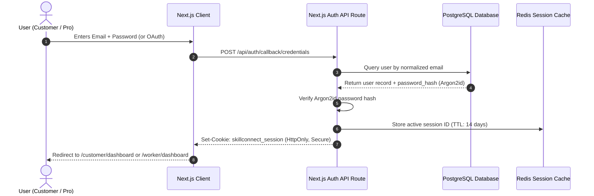

# Authentication and Authorization — SkillConnect

| Document Attribute | Details |
| :--- | :--- |
| **Document ID** | `DOC-ARCH-006` |
| **Status** | Approved |
| **Owner** | Lead Security Architect |
| **Target Audience** | Backend Engineers, Security Reviewers, Frontend Engineers |
| **Last Updated** | October 2026 |

---

## 1. Authentication Architecture

SkillConnect employs an industry-standard token-based authentication system utilizing **NextAuth.js / Auth.js (or Clerk)** with JSON Web Tokens (JWT) encrypted into `HttpOnly`, `SameSite=Lax`, `Secure` browser session cookies.



---

## 2. Session Management & Token Configuration

* **Cookie Name**: `__Host-skillconnect_session` (in production)
* **Attributes**: `HttpOnly; Secure; SameSite=Lax; Path=/; Max-Age=1209600 (14 days)`
* **Token Payload**:
  ```json
  {
    "sub": "usr_991823a",
    "role": "PROFESSIONAL",
    "email": "marcus@vanceplumbing.com",
    "profileId": "pro_981a2b",
    "verifiedStatus": "VERIFIED",
    "iat": 1791200000,
    "exp": 1792409600
  }
  ```
* **Phase 1 Prototype Boundary**: In Phase 1 demonstration mode, authentication forms run client-side validation only. Passwords entered are cleared from React memory upon submit, no cookie is set, and a helpful demo toast directs the user to sample customer/worker dashboards.

---

## 3. Role-Based Access Control (RBAC) Middleware

Next.js Edge Middleware (`middleware.ts`) guards protected routes before executing server handlers:

```typescript
// Architectural specification for Next.js route protection
export const routePermissions = {
  '/customer/:path*': ['CUSTOMER', 'ADMIN'],
  '/worker/:path*': ['PROFESSIONAL', 'ADMIN'],
  '/admin/:path*': ['ADMIN'],
  '/partner/:path*': ['PARTNER', 'ADMIN'],
} as const;
```

---

## 4. Related Documentation
* [Role Permission Matrix](file:///docs/security/ROLE-PERMISSION-MATRIX.md)
* [Security Requirements](file:///docs/security/SECURITY-REQUIREMENTS.md)
* [API Contract Specification](file:///docs/architecture/API-CONTRACT-SPECIFICATION.md)
