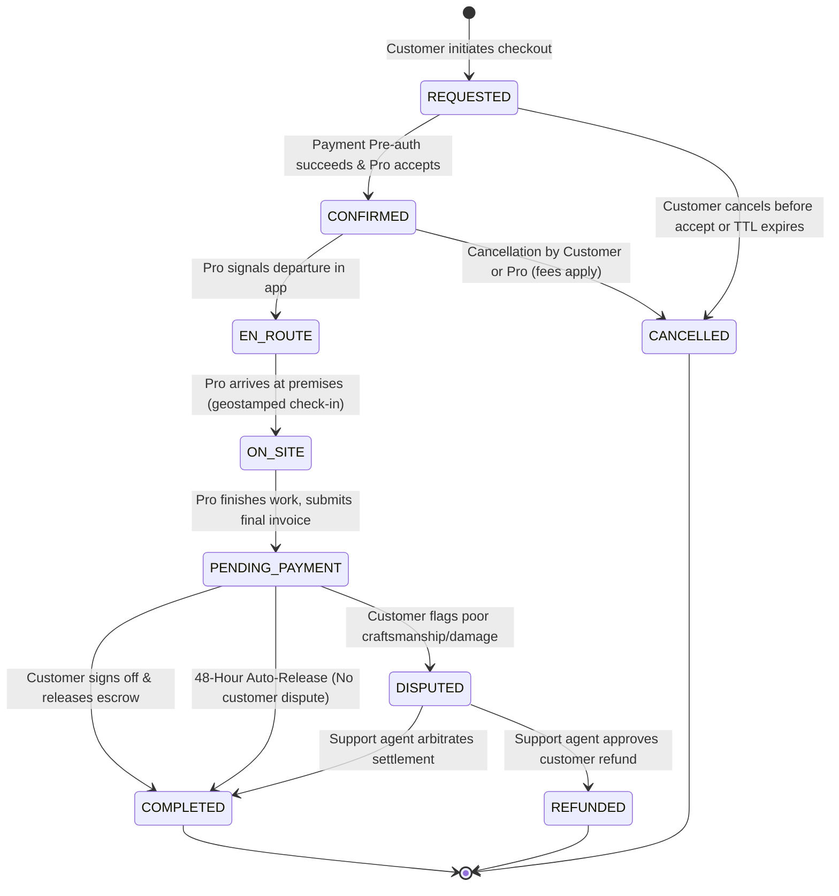

# Booking Lifecycle & Business Rules — SkillConnect

| Document Attribute | Details |
| :--- | :--- |
| **Document ID** | `DOC-ARCH-008` |
| **Status** | Approved |
| **Owner** | Lead Backend Architect & Business Rules Analyst |
| **Target Audience** | Backend Engineers, QA Engineers, Product Managers |
| **Last Updated** | October 2026 |

---

## 1. Booking State Machine (FSM)

The booking journey is governed by an immutable finite state machine enforced at the database transaction layer:



---

## 2. Allowed Transitions & Authority Matrix

| Transition | From State | To State | Authorized Initiator | Business Preconditions & Actions |
| :--- | :--- | :--- | :--- | :--- |
| `ACCEPT_BOOKING` | `REQUESTED` | `CONFIRMED` | Professional | Valid payment pre-auth hold exists; slot locked in calendar. |
| `DISPATCH_EN_ROUTE`| `CONFIRMED` | `EN_ROUTE` | Professional | Within 60 minutes of scheduled start time; SMS alert sent to customer. |
| `CHECK_IN_ARRIVAL` | `EN_ROUTE` | `ON_SITE` | Professional | Geolocation coordinates within 500m of customer address. |
| `SUBMIT_INVOICE` | `ON_SITE` | `PENDING_PAYMENT` | Professional | Itemized labor and parts entered; customer notification sent. |
| `SIGN_OFF_RELEASE`| `PENDING_PAYMENT` | `COMPLETED` | Customer / System | Escrow funds transferred via Stripe Connect; review prompt triggered. |
| `RAISE_DISPUTE` | `PENDING_PAYMENT` | `DISPUTED` | Customer | Within 48 hours of invoice; holds escrow payout; alerts Support queue. |
| `CANCEL_BOOKING` | `CONFIRMED` | `CANCELLED` | Customer / Pro | Evaluates cancellation window (>2h free, <2h $25 late fee). |

---

## 3. Concurrency Protection & Distributed Slot Locking

To prevent race conditions where two customers attempt to book the exact same technician time slot simultaneously:
1. When a user enters Step 2 of the booking flow, the frontend sends a reservation claim to Redis:
   ```typescript
   const lockKey = `lock:slot:${professionalId}:${slotIsoString}`;
   const acquired = await redis.set(lockKey, customerSessionId, 'NX', 'EX', 900); // 15-minute TTL
   if (!acquired) {
     throw new SlotAlreadyReservedException();
   }
   ```
2. If checkout completes, the lock is committed to the PostgreSQL `bookings` table as an active booking record, and the temporary Redis lock is removed.
3. If the user abandons the checkout, the Redis lock automatically expires after 15 minutes, returning the slot to public availability.

---

## 4. Phase 1 Prototype Deterministic Behavior

In Phase 1 frontend prototype mode:
* No server locks are held.
* Booking reference is generated deterministically (e.g., `DEMO-BOOK-` + last 4 digits of current timestamp).
* The booking object is saved to `localStorage` under `skillconnect_demo_bookings` and instantly rendered in the customer dashboard's "Upcoming Bookings" list.

---

## 5. Related Documentation
* [API Contract Specification](file:///docs/architecture/API-CONTRACT-SPECIFICATION.md)
* [Payments, Commissions, and Refunds](file:///docs/architecture/PAYMENTS-COMMISSIONS-AND-REFUNDS.md)
* [Cancellation, Refund, and Dispute Policy](file:///docs/policies/CANCELLATION-REFUND-AND-DISPUTE-POLICY.md)
