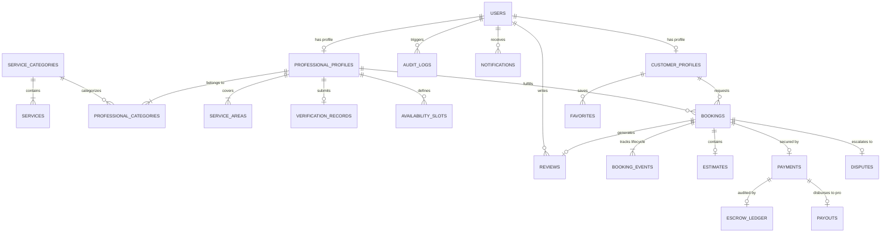

# Data Model and Relationships — SkillConnect

| Document Attribute | Details |
| :--- | :--- |
| **Document ID** | `DOC-ARCH-004` |
| **Status** | Approved |
| **Owner** | Lead Database Architect |
| **Target Audience** | Backend Engineers, Database Designers, Security Architects |
| **Last Updated** | October 2026 |

---

## 1. Entity-Relationship Diagram (ERD)



---

## 2. Core Relational Entities & Schema Definitions

### 2.1 `users`
* `id`: UUID (Primary Key, default `gen_random_uuid()`)
* `email`: VARCHAR(255) (Unique, Indexed, Case-Insensitive)
* `password_hash`: VARCHAR(255) (Nullable for OAuth, Argon2id format)
* `phone_number`: VARCHAR(32) (Encrypted at rest, E.164 format)
* `role`: ENUM (`GUEST`, `CUSTOMER`, `PROFESSIONAL`, `ADMIN`, `SUPPORT`, `PARTNER`)
* `status`: ENUM (`PENDING_VERIFICATION`, `ACTIVE`, `SUSPENDED`, `DELETED`)
* `created_at`: TIMESTAMPTZ (Default `now()`)
* `updated_at`: TIMESTAMPTZ (Default `now()`)

### 2.2 `professional_profiles`
* `id`: UUID (Primary Key)
* `user_id`: UUID (Foreign Key -> `users.id`, Unique)
* `business_name`: VARCHAR(255)
* `slug`: VARCHAR(255) (Unique, Indexed)
* `bio`: TEXT
* `experience_years`: INT
* `portrait_image_url`: VARCHAR(1024)
* `hourly_rate_cents`: INT (Stored in smallest currency unit)
* `diagnostic_fee_cents`: INT (Default: 6500 = $65.00)
* `is_available_today`: BOOLEAN (Default `false`, Indexed)
* `verified_status`: ENUM (`UNVERIFIED`, `PENDING_REVIEW`, `VERIFIED`, `REJECTED`)
* `average_rating`: NUMERIC(3, 2) (Cached aggregate, default 5.00)
* `review_count`: INT (Cached count, default 0)
* `location_geom`: GEOMETRY(Point, 4326) (Spatial PostGIS Point)
* `service_radius_meters`: INT (Default 25000 = 25km)

### 2.3 `service_categories` & `services`
* `service_categories`:
  * `id`: UUID (Primary Key)
  * `name`: VARCHAR(100) (e.g., "Plumbing", "Electrical", "Carpentry")
  * `slug`: VARCHAR(100) (Unique, Indexed)
  * `icon_name`: VARCHAR(50) (e.g., "Wrench", "Zap", "Hammer")
  * `base_diagnostic_cents`: INT
* `services`:
  * `id`: UUID (Primary Key)
  * `category_id`: UUID (Foreign Key -> `service_categories.id`)
  * `title`: VARCHAR(255) (e.g., "Water Heater Replacement", "Circuit Breaker Diagnostic")
  * `indicative_starting_price_cents`: INT

### 2.4 `bookings`
* `id`: UUID (Primary Key)
* `reference_code`: VARCHAR(32) (Unique, e.g., `SC-2026-9812`)
* `customer_id`: UUID (Foreign Key -> `customer_profiles.id`, Indexed)
* `professional_id`: UUID (Foreign Key -> `professional_profiles.id`, Indexed)
* `service_id`: UUID (Foreign Key -> `services.id`)
* `status`: ENUM (
  `REQUESTED`, `CONFIRMED`, `EN_ROUTE`, `ON_SITE`, 
  `PENDING_PAYMENT`, `COMPLETED`, `CANCELLED`, `DISPUTED`
)
* `scheduled_start_time`: TIMESTAMPTZ (Indexed)
* `scheduled_end_time`: TIMESTAMPTZ
* `issue_description`: TEXT
* `service_address_encrypted`: TEXT (AES-256-GCM encrypted)
* `cancellation_reason`: TEXT (Nullable)
* `created_at`: TIMESTAMPTZ (Default `now()`)

### 2.5 `payments` & `escrow_ledger`
* `payments`:
  * `id`: UUID (Primary Key)
  * `booking_id`: UUID (Foreign Key -> `bookings.id`, Unique)
  * `stripe_payment_intent_id`: VARCHAR(255) (Unique, Indexed)
  * `status`: ENUM (`PRE_AUTHORIZED`, `HELD_IN_ESCROW`, `RELEASED`, `REFUNDED`, `FAILED`)
  * `authorized_amount_cents`: INT
  * `final_captured_cents`: INT (Nullable until job sign-off)
  * `platform_commission_cents`: INT
  * `technician_payout_cents`: INT
* `escrow_ledger`:
  * `id`: UUID (Primary Key)
  * `payment_id`: UUID (Foreign Key -> `payments.id`)
  * `action`: ENUM (`HOLD_PLACED`, `FUNDS_RELEASED`, `FEE_DEDUCTED`, `REFUND_ISSUED`)
  * `amount_cents`: INT
  * `timestamp`: TIMESTAMPTZ (Default `now()`)

### 2.6 `reviews`
* `id`: UUID (Primary Key)
* `booking_id`: UUID (Foreign Key -> `bookings.id`, Unique)
* `author_user_id`: UUID (Foreign Key -> `users.id`)
* `target_user_id`: UUID (Foreign Key -> `users.id`)
* `rating_stars`: SMALLINT (Check: 1 <= rating_stars <= 5)
* `comment`: TEXT
* `is_verified_booking`: BOOLEAN (Always `true` in production)
* `pro_response_comment`: TEXT (Nullable)
* `created_at`: TIMESTAMPTZ (Default `now()`)

---

## 3. Database Indexes & Query Optimization

```sql
-- Spatial distance index for technician discovery
CREATE INDEX idx_pros_location_geom ON professional_profiles USING GIST (location_geom);

-- Composite index for fast category + availability filtering
CREATE INDEX idx_pros_category_avail ON professional_profiles (is_available_today, verified_status, average_rating DESC);

-- Fast booking lookups by user and status
CREATE INDEX idx_bookings_cust_status ON bookings (customer_id, status);
CREATE INDEX idx_bookings_pro_schedule ON bookings (professional_id, scheduled_start_time);
```

---

## 4. Related Documentation
* [System Architecture](file:///docs/architecture/SYSTEM-ARCHITECTURE.md)
* [API Contract Specification](file:///docs/architecture/API-CONTRACT-SPECIFICATION.md)
* [Payments, Commissions, and Refunds](file:///docs/architecture/PAYMENTS-COMMISSIONS-AND-REFUNDS.md)
