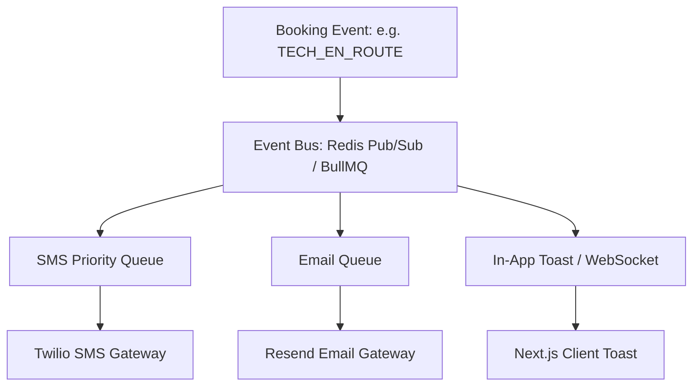

# Notifications and Messaging Architecture — SkillConnect

| Document Attribute | Details |
| :--- | :--- |
| **Document ID** | `DOC-ARCH-011` |
| **Status** | Approved |
| **Owner** | Lead Communications Engineer |
| **Target Audience** | Backend Developers, DevOps, Frontend Engineers |
| **Last Updated** | October 2026 |

---

## 1. Notification Subsystem Architecture

SkillConnect delivers event-driven notifications across three primary channels:
1. **SMS (Twilio)**: Critical time-sensitive alerts (technician dispatched, technician arrived, cancellation).
2. **Transactional Email (Resend)**: Booking confirmations, itemized receipts, dispute summaries, weekly performance digests.
3. **In-App Toast & Web Push**: Real-time dashboard updates during active sessions.

---

## 2. Notification Triggers & Templates Matrix

| Event Trigger | Recipient | Channel | Priority | Template Content Summary |
| :--- | :--- | :--- | :--- | :--- |
| `BOOKING_CONFIRMED` | Customer | Email + SMS | High | "Appointment confirmed with [Pro] for [Date/Time]. Ref: [Code]" |
| `NEW_JOB_DISPATCHED`| Professional| SMS + Push | Critical | "New [Category] job available in [Area] for [Date]. Tap to accept." |
| `TECH_EN_ROUTE` | Customer | SMS | High | "[Pro] is en route to your address. Estimated arrival: 15 mins." |
| `INVOICE_SUBMITTED` | Customer | Email + Push | High | "[Pro] has completed work. Review itemized bill of $[Amount] to sign off."|
| `PAYOUT_DISBURSED` | Professional| Email | Normal | "Payout of $[Amount] sent to your bank via Stripe Connect." |

---

## 3. Privacy & Delivery Safeguards

* **Phone Number Masking (Proxy Calling)**: To safeguard customer and technician privacy, outbound phone calls and SMS utilize Twilio Proxy / masked virtual numbers. Neither party sees the other's real mobile number.
* **Quiet Hours Enforcement**: Marketing and non-urgent notifications are suppressed between 9:00 PM and 8:00 AM in the recipient's local timezone.

---

## 4. Phase 1 Prototype Implementation

In Phase 1 demonstration mode:
* No external SMS or email gateways are triggered.
* Actions trigger accessible client-side toast notifications (`Toast` component) confirming demo actions (e.g., *"Job accepted (Demo mode - no external alert sent)"*).

---

## 5. Related Documentation
* [System Architecture](file:///docs/architecture/SYSTEM-ARCHITECTURE.md)
* [Third-Party Integrations](file:///docs/architecture/THIRD-PARTY-INTEGRATIONS.md)
* [Privacy and Data Handling](file:///docs/security/PRIVACY-AND-DATA-HANDLING.md)
