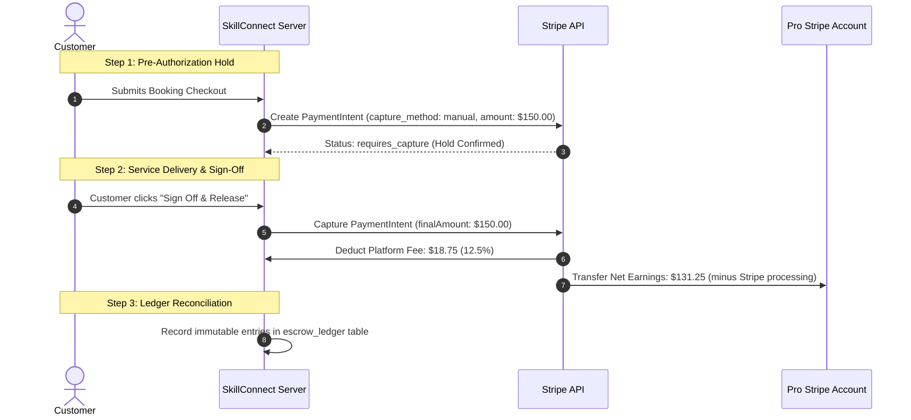

# Payments, Commissions, and Refunds — SkillConnect

| Document Attribute | Details |
| :--- | :--- |
| **Document ID** | `DOC-ARCH-012` |
| **Status** | Approved |
| **Owner** | Lead Fintech Architect & Payment Systems Engineer |
| **Target Audience** | Backend Engineers, Finance, Compliance Officers |
| **Last Updated** | October 2026 |

---

## 1. Financial Architecture & Stripe Connect Integration

SkillConnect utilizes **Stripe Connect Express** to power an escrow-style marketplace payment engine that splits charges between platform revenue and technician earnings.



---

## 2. Commission Calculation Rules

Platform commissions are levied strictly against billable labor and diagnostic fees (parts and materials pass through at zero commission to avoid markup inflation):

```typescript
export interface InvoiceBreakdown {
  diagnosticFeeCents: number;
  laborTotalCents: number;
  partsMaterialsCents: number;
  isProSubscribed: boolean; // Pro tier gets reduced 8.5% rate
}

export function calculatePlatformSplit(invoice: InvoiceBreakdown) {
  const commissionRate = invoice.isProSubscribed ? 0.085 : 0.125;
  const commissionableTotal = invoice.diagnosticFeeCents + invoice.laborTotalCents;
  
  const platformCommissionCents = Math.round(commissionableTotal * commissionRate);
  const totalGrossCents = invoice.diagnosticFeeCents + invoice.laborTotalCents + invoice.partsMaterialsCents;
  
  // Technician receives full reimbursement for parts + remainder of labor/inspection
  const technicianDisbursedCents = totalGrossCents - platformCommissionCents;

  return {
    totalGrossCents,
    platformCommissionCents,
    technicianDisbursedCents,
  };
}
```

---

## 3. Dispute & Escrow Hold Rules

* **48-Hour Review Window**: When a technician submits an invoice, funds remain in escrow for 48 hours to allow customer inspection. If the customer does not open a dispute, funds auto-release.
* **Dispute Pause**: If a customer flags damage or incomplete work within the 48-hour window, the automated capture is paused, preventing payout until Support resolution.
* **Chargeback Protection**: Technicians are indemnified against fraudulent customer credit card chargebacks if geostamped arrival proofs and signed work tickets exist.

---

## 4. Related Documentation
* [Business Model and Revenue](file:///docs/product/BUSINESS-MODEL-AND-REVENUE.md)
* [Data Model and Relationships](file:///docs/architecture/DATA-MODEL-AND-RELATIONSHIPS.md)
* [Cancellation, Refund, and Dispute Policy](file:///docs/policies/CANCELLATION-REFUND-AND-DISPUTE-POLICY.md)
