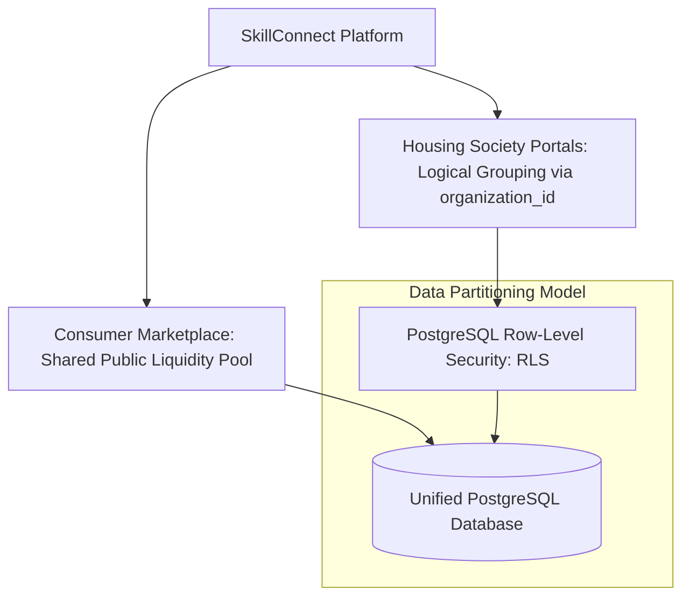

# SaaS Organization & Tenancy Decisions — SkillConnect

| Document Attribute | Details |
| :--- | :--- |
| **Document ID** | `DOC-ARCH-007` |
| **Status** | Approved |
| **Owner** | Chief Systems Architect |
| **Target Audience** | System Architects, Database Engineers, Product Leadership |
| **Last Updated** | October 2026 |

---

## 1. Architectural Question & Evaluation

**Question**: Does SkillConnect require separate multi-tenant database clusters or isolated schemas for each customer or service professional?



---

## 2. Decision: Shared Database with Logical Row-Level Security (RLS)

### 2.1 Context & Core Marketplace Dynamics
A two-sided local services marketplace relies fundamentally on a **shared liquidity pool**:
* A plumber in San Francisco must be discoverable by both individual homeowners (B2C) and residential property managers (B2B).
* Isolating database schemas per user or per contractor would shatter global search, fragment ratings, destroy network effects, and inflate infrastructure costs by 10x.

### 2.2 B2B Housing Society & Organization Tenancy
For commercial property managers and housing societies (HOAs), SkillConnect implements **Logical Multi-Tenancy** using an `organization_id` foreign key and PostgreSQL Row-Level Security (RLS):
* Tables with corporate scoping (`organization_members`, `corporate_invoices`, `facility_properties`, `bulk_dispatches`) include an indexed `organization_id UUID`.
* When a property manager queries the database, RLS policies restrict their view to their authorized properties and invoices:
  ```sql
  CREATE POLICY org_isolation_policy ON corporate_invoices
  FOR ALL
  TO authenticated_user
  USING (organization_id = current_setting('app.current_org_id')::uuid);
  ```

---

## 3. Benefits & Trade-Offs

| Evaluation Vector | Decision: Shared Pool + Logical RLS | Rejected Alternative: Multi-Tenant Schema-per-Org |
| :--- | :--- | :--- |
| **Marketplace Liquidity** | **Unified**: All verified pros accessible everywhere. | **Fragmented**: Pros would need re-onboarding per tenant. |
| **DevOps & Migration Complexity** | **Low**: Single migration run updates entire database. | **Extreme**: 500 migrations across 500 schemas; high risk of drift. |
| **Infrastructure Costs** | **Optimal**: Highly efficient connection pooling and caching. | **Severe**: High idle overhead per database connection. |
| **Data Privacy Guarantee** | **Strong**: Verified via RLS unit tests and middleware checks. | **Isolated**: Physical separation at schema level. |

---

## 4. Related Documentation
* [System Architecture](file:///docs/architecture/SYSTEM-ARCHITECTURE.md)
* [Data Model and Relationships](file:///docs/architecture/DATA-MODEL-AND-RELATIONSHIPS.md)
* [Role Permission Matrix](file:///docs/security/ROLE-PERMISSION-MATRIX.md)
