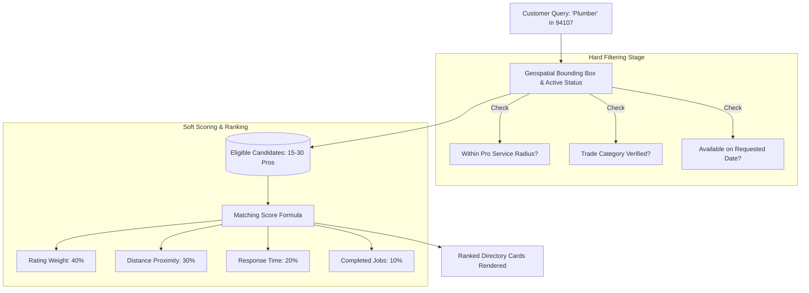

# Search, Location, and Matching Engine — SkillConnect

| Document Attribute | Details |
| :--- | :--- |
| **Document ID** | `DOC-ARCH-009` |
| **Status** | Approved |
| **Owner** | Lead Search & Algorithm Architect |
| **Target Audience** | Backend Engineers, Algorithm Specialists, Frontend Developers |
| **Last Updated** | October 2026 |

---

## 1. Search & Matching Architecture

SkillConnect matches customers with service technicians through a two-stage discovery engine:
1. **Hard Filtering (Geospatial & Availability Constraints)**: Eliminates technicians outside the operational service radius or without schedule openings.
2. **Soft Scoring (Relevance & Quality Ranking)**: Weights technician rating, historical response time, completed jobs in that specific category, and distance.



---

## 2. Geospatial Indexing (PostGIS)

In production (Phase 3), customer coordinates $(\text{Lat}_C, \text{Lon}_C)$ are compared against each technician's base shop location and defined operating radius:

```sql
SELECT 
    p.id,
    p.name,
    p.average_rating,
    p.review_count,
    p.hourly_rate_cents,
    ST_Distance(
        p.location_geom::geography, 
        ST_SetSRID(ST_Point(:customerLon, :customerLat), 4326)::geography
    ) / 1000.0 AS distance_km
FROM professional_profiles p
WHERE p.is_active = true
  AND p.verified_status = 'VERIFIED'
  AND ST_DWithin(
      p.location_geom::geography,
      ST_SetSRID(ST_Point(:customerLon, :customerLat), 4326)::geography,
      p.service_radius_meters
  )
ORDER BY distance_km ASC;
```

---

## 3. Client-Side Matcher Specification (Phase 1 Prototype)

In the Phase 1 prototype, the matcher operates client-side in `src/lib/search.ts`:
* Searches `name`, `profession`, `category`, `skills`, and `serviceAreas`.
* Evaluates `availableToday` toggle against mock data attributes.
* Filters by minimum rating (3.5+, 4.0+, 4.5+).
* Sorts by selected order (`recommended`, `rating`, `price-asc`).

---

## 4. Related Documentation
* [System Architecture](file:///docs/architecture/SYSTEM-ARCHITECTURE.md)
* [API Contract Specification](file:///docs/architecture/API-CONTRACT-SPECIFICATION.md)
* [Frontend Requirements](file:///docs/design/FRONTEND-REQUIREMENTS.md)
