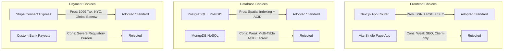

# Technology Stack and Rationale — SkillConnect

| Document Attribute | Details |
| :--- | :--- |
| **Document ID** | `DOC-ARCH-002` |
| **Status** | Approved |
| **Owner** | Chief Systems Architect |
| **Target Audience** | Engineering Leads, Full-Stack Developers, DevOps |
| **Last Updated** | October 2026 |

---

## 1. Complete Technology Matrix

| Layer / Domain | Selected Technology | Version | Key Responsibilities |
| :--- | :--- | :--- | :--- |
| **Frontend Framework** | **Next.js (App Router)** | `15.x / 16.x` | Hybrid SSR, SSG, streaming, layout management, routing |
| **UI Library** | **React** | `19.x` | Declarative UI, Server Components, client state hooks |
| **Language** | **TypeScript** | `5.x` | End-to-end static typing, strict mode enforcement |
| **Styling** | **Tailwind CSS** | `3.4.x / 4.x` | Utility-first CSS, design tokens, responsive breakpoints |
| **Animation** | **Motion for React** | `12.x` (`motion/react`) | Spring physics, layout animations, accessible transitions |
| **Icons** | **Lucide React** | `^1.16` / Latest | Accessible SVG icons, uniform stroke width and bounding box |
| **Data Validation** | **Zod** | `3.x` | Schema validation across API inputs and form state |
| **Database** | **PostgreSQL + PostGIS** | `16.x` | Relational integrity, ACID transactions, geospatial queries |
| **Database ORM/Query** | **Prisma / Kysely** | Latest | Type-safe migrations, query generation, connection pooling |
| **Cache & Distributed Lock**| **Redis** | `7.x` | Fast session store, search cache, distributed slot locks |
| **Payments & Escrow** | **Stripe Connect** | API v2024+ | Split payments, custom accounts, pre-auth holding |
| **Identity & Licensing** | **Persona / Stripe Identity**| v1 | Government ID verification and biometric liveness checks |
| **Communications** | **Twilio + Resend** | Latest | SMS dispatch alerts, transactional email confirmations |
| **Media Object Store** | **AWS S3 / Cloudflare R2** | - | Encrypted storage for job photos and compliance docs |

---

## 2. Technology Rationale & Trade-Off Analysis

### 2.1 Next.js App Router vs. Traditional SPA (Vite/React)
* **Rationale**: SkillConnect depends heavily on public search engine indexing (SEO) for long-tail search queries (e.g., *"licensed plumber in San Francisco 94107"*). Client-rendered SPAs suffer indexing penalties and slower First Contentful Paint (FCP). Next.js App Router allows Server Components to stream pre-rendered HTML while keeping client bundles small.
* **Trade-off**: Steeper learning curve around server/client boundaries; strict prohibition against calling browser APIs (`localStorage`, `window`) during SSR.

### 2.2 PostgreSQL with PostGIS vs. NoSQL (MongoDB / DynamoDB)
* **Rationale**: Marketplace transactions require multi-entity ACID consistency: updating booking status, releasing escrow funds, decrementing technician capacity, and generating transaction ledger records must succeed or fail atomically. PostGIS provides industry-standard spatial bounding box and distance algorithms (`ST_DWithin`) in microsecond queries.
* **Trade-off**: Requires structured schema migrations and vertical scaling limits compared to distributed document stores, easily mitigated by read-replicas.

### 2.3 Motion for React (`motion/react`) vs. Generic CSS
* **Rationale**: Multi-step booking wizards, filter drawers, and micro-interactions require interruptible physics-based spring animations that CSS alone cannot orchestrate cleanly. The modern `motion` package offers zero-runtime reduction hooks (`useReducedMotion`) ensuring total accessibility compliance.

### 2.4 Stripe Connect vs. Custom Escrow
* **Rationale**: Holding marketplace customer funds until job completion borders on escrow licensing under state and federal financial regulations. Stripe Connect handles KYC, anti-money laundering (AML), automated 1099 tax reporting for technicians, and chargeback protection out of the box.

---

## 3. Related Documentation
* [System Architecture](file:///docs/architecture/SYSTEM-ARCHITECTURE.md)
* [Repository and Module Structure](file:///docs/architecture/REPOSITORY-AND-MODULE-STRUCTURE.md)
* [Data Model and Relationships](file:///docs/architecture/DATA-MODEL-AND-RELATIONSHIPS.md)
