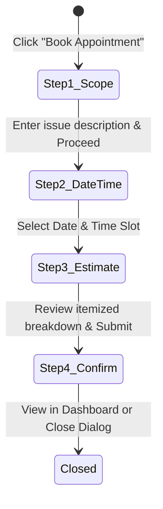

# Frontend Requirements & Interaction Specifications — SkillConnect

| Document Attribute | Details |
| :--- | :--- |
| **Document ID** | `DOC-DSGN-004` |
| **Status** | Approved |
| **Owner** | Lead Frontend Architect |
| **Target Audience** | Frontend Developers, QA Engineers, UI Designers |
| **Last Updated** | October 2026 |

---

## 1. Core Interaction Philosophy

Every visible button, switch, filter, and input in SkillConnect must have an immediate, predictable, and accessible response. Where backend services are mocked (in Phase 1), the UI must provide authentic client-side transitions and honest demo notifications rather than dead buttons or fake promises.

---

## 2. Search & Directory Filter Interactions

### 2.1 Full-Text & Location Matching
* **Trigger**: Search executes on `Enter` keypress, search icon button click, or direct debounced input (300ms).
* **Normalization**: Input is trimmed, lowercased, and sanitized of special regex characters.
* **Fields Matched**:
  * Professional `name` (e.g., "Marcus Vance")
  * Professional `profession` (e.g., "Master Plumber")
  * Category slug/title (e.g., "plumbing", "electrical")
  * Skills array (e.g., "pipe fitting", "circuit breaker", "water heater")
  * Service area (e.g., "Mission District", "Downtown", "94107")
* **Zero Results Behavior**: Displays friendly `EmptyState` component with search query highlighted and a single-click "Clear All Filters" button.

### 2.2 Directory Filters & Sorting
* **Category Filter**: Single-select dropdown or chip bar.
* **Rating Filter**: Minimum threshold (`>= 4.5`, `>= 4.0`, `>= 3.5`, or `All`).
* **Availability Switch**: Boolean toggle filtering for `availableToday === true`.
* **Price Tier Filter**: Filter matching starting rates across tiers ($: <$60/hr, $$: $60-$90/hr, $$$: $90+/hr).
* **Sorting Mechanism**:
  * `recommended`: Weighted score (Rating * 0.6 + Review Count * 0.4).
  * `rating`: Descending sort by rating.
  * `price-asc`: Ascending sort by starting hourly price.
* **Active Filter Chips**: Rendered above results grid; clicking an individual chip removes that filter; "Clear All" button resets all filters simultaneously.

---

## 3. Favorites State & Persistence

* **State**: Boolean toggled per professional ID.
* **A11y Label**: Dynamically switches:
  * Unselected: `aria-label="Save [Name] to favorites"`
  * Selected: `aria-label="Remove [Name] from favorites"`
* **Visual**: Heart icon transitions from outline (`text-muted`) to filled crimson (`text-rose-500 fill-rose-500`).
* **Persistence Layer**: Stored in browser `localStorage` under key `skillconnect_favorites`.
  * Safe client hydration guard: Read within `useEffect` to prevent React hydration mismatch.
  * Try/catch wrap to gracefully handle storage quota or private browsing exceptions.

---

## 4. Multi-Step Demo Booking Flow

The booking flow operates as an accessible dialog on desktop and an animated bottom-sheet on mobile.

### 4.1 Step 1: Service Scope
* Displays selected professional's card header and primary service.
* Form Field: Issue description textarea (min 10 characters, required).
* Optional file/photo upload area (mock attachment pill in Phase 1).

### 4.2 Step 2: Date & Time Selection
* Selectable date carousel (Today, Tomorrow, +3 consecutive days).
* Time slots grouped by period: Morning (8:00 AM, 10:00 AM), Afternoon (1:00 PM, 3:00 PM), Evening (5:00 PM).
* Unavailable slots rendered as disabled (`aria-disabled="true"`) with strike-through styling.

### 4.3 Step 3: Estimate & Terms Review
* Itemized price table:
  * Diagnostic Inspection Fee: `$65.00`
  * Indicative Labor Rate: `$85.00 / hr`
  * Estimated Total Envelope: `$65.00 – $150.00`
* Prominent Disclosure: *"Sample estimate for prototype testing. Final quote provided on-site. Diagnostic fee applies if repair is declined."*

### 4.4 Step 4: Deterministic Confirmation
* Generates reference ID format: `DEMO-BOOK-xxxx`.
* Displays appointment summary card.
* Explicit Prototype Banner: *"Demo only — no real professional has been contacted and no charges were incurred."*
* Saves record to `localStorage` under `skillconnect_demo_bookings`.
* Action Buttons: "View in Customer Dashboard" and "Done / Browse More".

---

## 5. Forms & Validation Specifications

* **Field Requirements**:
  * Visible `<label>` element associated via `htmlFor`.
  * Inline validation error text below input with `aria-live="polite"`.
  * Invalid input border transitions to `border-red-600 focus:ring-red-600`.
* **Password Fields**: Includes an accessible visibility toggle button (`aria-label="Show password"` / `aria-label="Hide password"`).
* **Submission Safeguard**: Passwords are wiped from memory immediately upon demo submit and never logged or stored.

---

## 6. Dashboards & Stateful Controls

### 6.1 Worker Availability Switch
* Located in `/worker/dashboard`.
* Switch toggles between `Available Today` and `Off Duty`.
* Immediate visual status badge update (Green vs Gray).
* Triggers accessible toast: *"Availability updated to [Status]. (Demo UI state)"*

### 6.2 Job Request Action Buttons
* "Accept Request" transitions card to "Confirmed" status badge.
* "Decline" transitions card to "Declined" state with undo option.
* Clear toast notification confirming local demo state change.

---

## 7. Related Documentation
* [Route and Page Inventory](file:///docs/design/ROUTE-AND-PAGE-INVENTORY.md)
* [UI Design System](file:///docs/design/UI-DESIGN-SYSTEM.md)
* [Animation and Motion Guidelines](file:///docs/design/ANIMATION-AND-MOTION-GUIDELINES.md)
* [Accessibility Requirements](file:///docs/design/ACCESSIBILITY-REQUIREMENTS.md)
