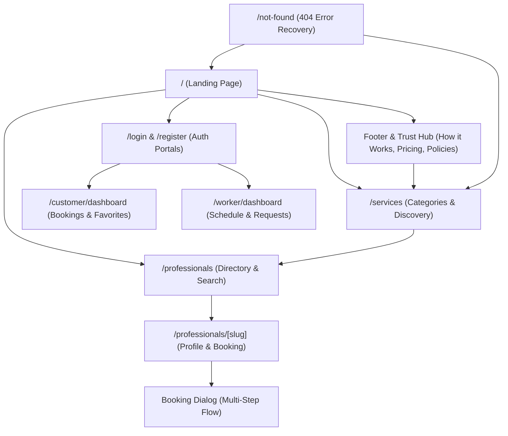

# Information Architecture (IA) — SkillConnect

| Document Attribute | Details |
| :--- | :--- |
| **Document ID** | `DOC-DSGN-001` |
| **Status** | Approved |
| **Owner** | Lead UI/UX Architect |
| **Target Audience** | Frontend Engineers, Designers, Product Managers |
| **Last Updated** | October 2026 |

---

## 1. System Information Architecture & Site Map

SkillConnect organizes information into clear discovery, transaction, and operational clusters designed to minimize cognitive overhead and eliminate dead ends.

---

## 2. Navigation Hierarchy & Content Groupings

### 2.1 Global Primary Header
* **Brand Anchor**: SkillConnect Logo & Tagline ("Find trusted help. Book confidently.").
* **Primary Navigation Links**:
  * `Services`: Direct link to `/services` directory.
  * `Find Professionals`: Direct link to `/professionals` directory.
  * `How It Works`: Smooth anchor or link to platform explanation.
* **Secondary / Utility Actions**:
  * `Sign In`: Links to `/login`.
  * `Join as a Pro`: Direct call to action linking to `/register?role=professional`.
  * `Customer Dashboard` / `Worker Dashboard` (Context-aware switcher in demo prototype).

### 2.2 Global Footer Taxonomy
* **Service Verticals**: Direct links to top trade categories (`/professionals?category=plumbing`, `/professionals?category=electrical`, etc.).
* **For Customers**: How it Works, Transparent Pricing Guarantee, HomeCare+ Membership, Safety & Trust.
* **For Professionals**: Pro Registration, Pro Membership Benefits, Trade Partner Code of Conduct.
* **Legal & Compliance**: Terms of Service, Privacy Policy, Cancellation & Refund Policy, Cookie Preferences.
* **Prototype Notice**: Prominent footer disclaimer indicating prototype environment status.

---

## 3. Page Context & State Persistence Model

| Route | Primary Content | Filter / Search State | Modal / Overlay State |
| :--- | :--- | :--- | :--- |
| `/` | Hero, Category Grid, Featured Pros, How it Works, Trust, Worker CTA | Search term + Postal Code (Pushed to `/professionals`) | Mobile Navigation Menu |
| `/services` | 7 Primary Trade Categories + Sub-Service breakdowns | Search input filter | Mobile Filter Drawer |
| `/professionals` | Paginated Pro Card Grid, Match Counter | Category, Rating, Availability, Price, Sort | Mobile Filter Drawer |
| `/professionals/[slug]` | Bio, Badges, Rates, Reviews, Hours, Related Pros | None (Context bound to slug) | `BookingFlowDialog` |
| `/customer/dashboard` | Active Bookings, Booking History, Saved Favorites | Tab selector (Active / Past / Favorites) | Booking Detail Drawer |
| `/worker/dashboard` | Availability Switch, Job Requests, Revenue, Metrics | Tab selector (Pending / Active / History) | Job Request Details Modal |
| `/login` & `/register` | Form Fields, Field-level validation, Demo State | Role Switcher (Customer vs Pro) | Demo feedback toast |

---

## 4. Related Documentation
* [Route and Page Inventory](file:///docs/design/ROUTE-AND-PAGE-INVENTORY.md)
* [Frontend Requirements](file:///docs/design/FRONTEND-REQUIREMENTS.md)
* [UI Design System](file:///docs/design/UI-DESIGN-SYSTEM.md)
