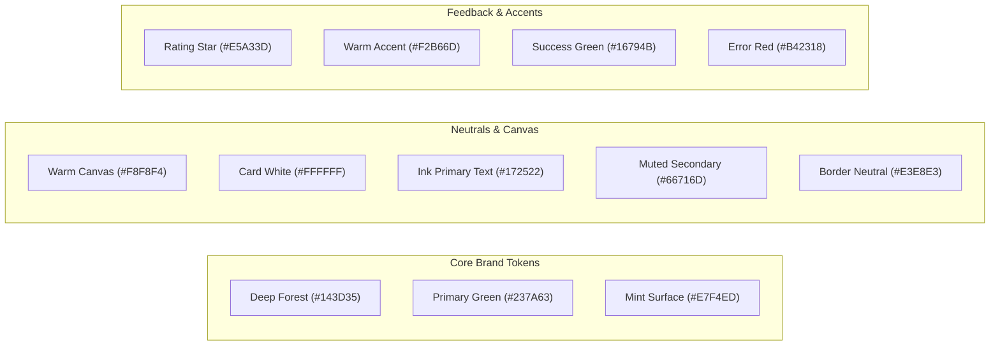

# UI Design System — SkillConnect

| Document Attribute | Details |
| :--- | :--- |
| **Document ID** | `DOC-DSGN-003` |
| **Status** | Approved |
| **Owner** | Lead Design Systems Engineer |
| **Target Audience** | Frontend Developers, UI/UX Designers |
| **Last Updated** | October 2026 |

---

## 1. Visual Direction & Brand Philosophy

SkillConnect avoids the sterile, corporate aesthetic of generic SaaS templates and the cluttered, aggressive advertising of traditional lead-generation directories. The visual tone is:
* **Trustworthy & Grounded**: Calm forest greens, clean off-white canvas, and warm amber accents evoking reliability and craftsmanship.
* **Warm & Approachable**: Generous whitespace, tactile cards, legible typography, and rounded contours that feel inviting to both homeowners and tradespeople.
* **Clarity-First**: Content-driven layouts where pricing, ratings, and availability status are immediately scannable without sensory overload.

---

## 2. Color Palette & Design Tokens



### 2.1 CSS Variables / Tailwind Token Mapping
```css
:root {
  /* Brand Tokens */
  --color-brand-forest: #143d35;
  --color-brand-primary: #237a63;
  --color-brand-primary-hover: #1b6250;
  --color-brand-mint: #e7f4ed;
  --color-brand-mint-hover: #d8ece0;
  
  /* Canvas & Neutrals */
  --color-canvas-bg: #f8f8f4;
  --color-card-bg: #ffffff;
  --color-text-primary: #172522;
  --color-text-secondary: #66716d;
  --color-border-subtle: #e3e8e3;
  --color-border-strong: #c8d3cc;
  
  /* Semantic Highlights */
  --color-accent-amber: #e5a33d;
  --color-accent-warm: #f2b66d;
  --color-status-success: #16794b;
  --color-status-error: #b42318;
}
```

---

## 3. Typography Hierarchy

SkillConnect employs clean, legible modern sans-serif typography (e.g., `Inter`, `Geist`, or system-ui fallback):

| Style Level | Font Size (Desktop) | Font Size (Mobile) | Line Height | Font Weight | Tracking | Usage |
| :--- | :--- | :--- | :--- | :--- | :--- | :--- |
| **Display H1** | 44px (2.75rem) | 32px (2.0rem) | 1.15 | 800 (Extrabold) | -0.025em | Main hero headline only |
| **Section H2** | 32px (2.0rem) | 24px (1.5rem) | 1.25 | 700 (Bold) | -0.02em | Section titles |
| **Subsection H3** | 22px (1.375rem) | 18px (1.125rem) | 1.35 | 600 (Semibold) | -0.01em | Card titles, modal headers |
| **Body Large** | 18px (1.125rem) | 16px (1.0rem) | 1.50 | 400 (Regular) | 0.00em | Hero subtitle, intro copy |
| **Body Regular** | 16px (1.0rem) | 15px (0.9375rem) | 1.50 | 400 (Regular) | 0.00em | Standard body copy, reviews |
| **Body Small** | 14px (0.875rem) | 13px (0.8125rem) | 1.45 | 400 / 500 | 0.00em | Metadata, secondary labels |
| **Eyebrow / Badge** | 12px (0.75rem) | 11px (0.6875rem) | 1.30 | 600 (Semibold) | +0.05em | Category chips, status pills |

---

## 4. Spacing Scale & Container Layouts

* **Spacing Scale (8pt Grid)**:
  * `space-1`: 4px (tight padding, chip gaps)
  * `space-2`: 8px (icon margins, input padding)
  * `space-3`: 12px (card inner elements)
  * `space-4`: 16px (standard component padding)
  * `space-6`: 24px (card padding, grid gaps)
  * `space-8`: 32px (section gap on mobile)
  * `space-12`: 48px (desktop section gutters)
  * `space-16`: 64px (major section rhythm)
  * `space-20`: 80px (hero padding)
* **Container Boundaries**:
  * Max desktop width: `1280px` (`max-w-7xl`) centered with `px-4 sm:px-6 lg:px-8`.
  * Compact form/auth container: `480px` (`max-w-md`).
  * Modal/Dialog content container: `560px` (`max-w-lg`).

---

## 5. Shape, Borders & Shadows

* **Border Radius**:
  * Main Cards: `18px` (`rounded-2xl`).
  * Inputs and Buttons: `12px` (`rounded-xl`).
  * Chips and Status Badges: `9999px` (`rounded-full`).
* **Borders**:
  * Subtle `1px solid var(--color-border-subtle)` across all cards and containers.
* **Shadow Hierarchy**:
  * `shadow-sm`: `0 1px 2px 0 rgba(20, 61, 53, 0.04)` (Cards default).
  * `shadow-md`: `0 4px 12px -2px rgba(20, 61, 53, 0.08)` (Card hover elevation).
  * `shadow-xl`: `0 20px 25px -5px rgba(20, 61, 53, 0.12)` (Modals and dropdown overlays).

---

## 6. Component Conventions

### 6.1 Buttons
* **Primary**: Background `#237A63`, white text, hover `#1B6250`, active scale `0.98`, focus ring `2px #237A63` offset 2px.
* **Secondary**: Background `#E7F4ED`, text `#143D35`, hover `#D8ECE0`.
* **Outline**: Background transparent, border `1px solid #E3E8E3`, text `#172522`, hover bg `#F8F8F4`.
* **Ghost**: Text `#66716D`, hover text `#172522`, background hover `rgba(0,0,0,0.04)`.

### 6.2 Professional Card Anatomy
1. **Aspect-Ratio Photo**: 1:1 square or 4:3 landscape with `object-cover` and rounded-xl top/inset.
2. **Badge Row**: Verification badge ("Verified Pro") + Favorite heart toggle.
3. **Identity**: Full Name (Semibold H3) + Primary Trade Title.
4. **Rating Row**: Amber star icon + numerical score (e.g., 4.9) + review count in parentheses.
5. **Location & Price Row**: Neighborhood text + starting hourly / diagnostic fee.
6. **Primary Action**: Full-width or right-aligned "View Profile" button.

---

## 7. Related Documentation
* [Frontend Requirements](file:///docs/design/FRONTEND-REQUIREMENTS.md)
* [Responsive Design](file:///docs/design/RESPONSIVE-DESIGN.md)
* [Animation and Motion Guidelines](file:///docs/design/ANIMATION-AND-MOTION-GUIDELINES.md)
* [Accessibility Requirements](file:///docs/design/ACCESSIBILITY-REQUIREMENTS.md)
