# CI/CD and Deployment Plan — SkillConnect

| Document Attribute | Details |
| :--- | :--- |
| **Document ID** | `DOC-OPS-004` |
| **Status** | Approved |
| **Owner** | Lead DevOps Engineer |
| **Target Audience** | DevOps, All Engineers, Release Managers |
| **Last Updated** | October 2026 |

---

## 1. Automated CI/CD Pipeline Architecture

SkillConnect uses **GitHub Actions** for automated continuous integration and **Vercel / AWS** for zero-downtime continuous deployment:

```mermaid
graph LR
    PR[Pull Request Opened] --> Lint[Lint & TypeCheck: ESLint + tsc]
    Lint --> Unit[Unit & Component Tests: Vitest]
    Unit --> Build[Next.js Production Build: next build]
    Build --> A11y[Accessibility Audit: axe-core]
    A11y --> Preview[Deploy Preview Environment]
    
    Preview --> Merge[PR Merged to main]
    Merge --> ProductionDeploy[Automated Production Deployment]
    ProductionDeploy --> Smoke[Post-Deploy Smoke Tests]
```

---

## 2. Pipeline Stages and Quality Gates

### Stage 1: Pull Request Verification (Automated Gate)
Every pull request must pass the following checks before merge approval:
1. `npm run lint`: Zero ESLint warnings or errors.
2. `npx tsc --noEmit`: Strict TypeScript compilation passes with zero type errors.
3. `npm test`: All unit and integration test suites pass.
4. `npm run build`: Production Next.js bundle compiles successfully without missing route destinations or dynamic server usage errors.

### Stage 2: Staging Deployment
* Triggers automatically upon merging to `main`.
* Runs database migrations in dry-run mode, applies schema changes to staging database, and deploys preview build.
* Runs Playwright end-to-end smoke test suite against staging URL.

### Stage 3: Production Rollout & Rollback Strategy
* **Zero-Downtime Rollout**: Uses blue/green atomic container swapping or Vercel instant alias pointing.
* **Instant Rollback (Under 60 seconds)**:
  * If post-deploy health check fails (HTTP 5xx rate > 1%), traffic is immediately reverted to the previous healthy deployment artifact with 1 click.
  * Database migrations must be backwards-compatible (expand/contract pattern) to ensure rollbacks do not cause schema mismatch crashes.

---

## 3. Related Documentation
* [Environment and Configuration Plan](file:///docs/operations/ENVIRONMENT-AND-CONFIGURATION-PLAN.md)
* [Testing Strategy](file:///docs/operations/TESTING-STRATEGY.md)
* [Release Checklist](file:///docs/operations/RELEASE-CHECKLIST.md)
