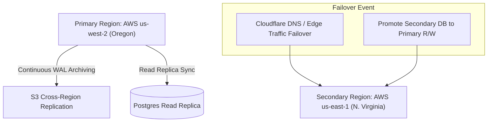

# Disaster Recovery and Business Continuity — SkillConnect

| Document Attribute | Details |
| :--- | :--- |
| **Document ID** | `DOC-OPS-008` |
| **Status** | Approved |
| **Owner** | Director of Infrastructure & SRE |
| **Target Audience** | SRE, DevOps, Executive Leadership, Legal Counsel |
| **Last Updated** | October 2026 |

---

## 1. Disaster Recovery Objectives (RPO & RTO)

SkillConnect defines rigorous resilience targets to maintain platform trust and transaction integrity during catastrophic failures:

* **Recovery Point Objective (RPO)**: **< 15 minutes** (maximum acceptable data loss).
* **Recovery Time Objective (RTO)**: **< 60 minutes** (maximum downtime before full restoration).

---

## 2. Disaster Scenarios & Failover Architecture

### 2.1 Scenario A: Primary Cloud Region Total Outage
1. **Detection**: Cloudflare health checks detect 3 consecutive probe failures to primary origin (`us-west-2`).
2. **DNS Shift**: Automated failover updates origin IP to secondary standby cluster in `us-east-1`.
3. **Database Promotion**: RDS Aurora automated failover promotes the secondary read-replica to primary read/write within 3 minutes.
4. **Platform Status**: Platform operational with < 5 minutes total transition latency.

### 2.2 Scenario B: Critical Database Data Corruption
1. **Immediate Quarantine**: Terminate application worker pools to halt further write corruption.
2. **Point-in-Time Recovery**: Spin up a new PostgreSQL instance using AWS PITR snapshot targeted to 60 seconds prior to the corruption timestamp.
3. **Verification**: Run data validation queries against financial transaction ledgers and active booking states.
4. **Traffic Re-route**: Re-point `DATABASE_URL` connection strings to restored instance and re-enable application nodes.

---

## 3. Crisis Communication Protocol

* **Status Page**: Real-time status broadcasted via external third-party status page (`status.skillconnect.com` hosted outside primary AWS infrastructure).
* **Stakeholder Alerts**: Incident commander notifies customer support desk and executive leadership within 15 minutes of SEV-1 declaration.
* **Customer Reassurance**: Automated SMS/Email dispatch informs customers with active in-progress bookings that technician appointments remain confirmed.

---

## 4. Related Documentation
* [Monitoring, Logging, and Backups](file:///docs/operations/MONITORING-LOGGING-AND-BACKUPS.md)
* [Security Incident Response](file:///docs/security/SECURITY-INCIDENT-RESPONSE.md)
* [Release Checklist](file:///docs/operations/RELEASE-CHECKLIST.md)
