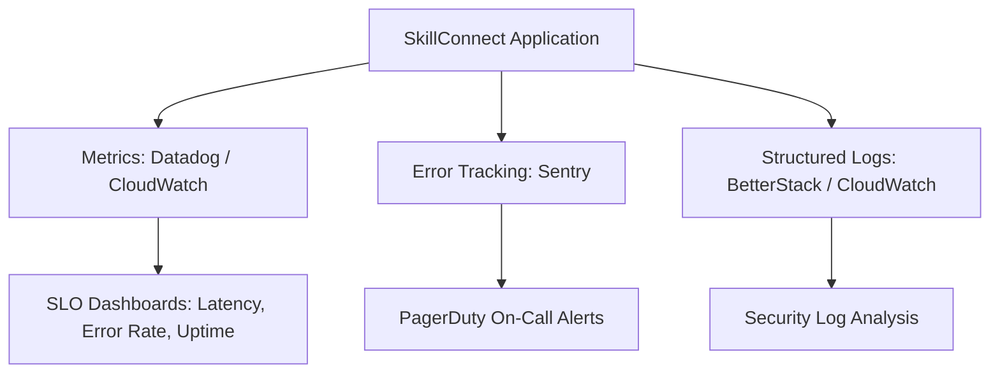

# Monitoring, Logging, and Backups — SkillConnect

| Document Attribute | Details |
| :--- | :--- |
| **Document ID** | `DOC-OPS-005` |
| **Status** | Approved |
| **Owner** | Lead Site Reliability Engineer (SRE) |
| **Target Audience** | SRE, DevOps, On-Call Responders |
| **Last Updated** | October 2026 |

---

## 1. Observability Stack & Telemetry

SkillConnect monitors platform health through three telemetry pillars:



### 1.1 Service Level Objectives (SLOs)
* **Availability**: 99.9% uptime (<= 43.8 minutes unplanned downtime per month).
* **API P95 Latency**: <= 200ms for search queries; <= 100ms for static page loads.
* **Error Budget**: <= 0.05% of all HTTP transactions result in 5xx server errors.

---

## 2. Structured Logging & PII Masking

All backend log entries must be emitted as structured JSON:
```json
{
  "timestamp": "2026-10-04T17:19:00Z",
  "level": "INFO",
  "service": "booking-service",
  "action": "BOOKING_CREATED",
  "bookingId": "bk_9801",
  "professionalId": "pro_981a2b",
  "customerId": "usr_7721",
  "executionTimeMs": 42,
  "requestId": "req_01HPX7K9V4"
}
```

### Strict PII Redaction Rules
Logs must **never** record:
* Customer passwords, tokens, or session IDs.
* Unmasked credit card numbers or bank accounts.
* Customer full street addresses or raw phone numbers (must be hashed or truncated).

---

## 3. Database Backup & Disaster Recovery RPO / RTO

* **Point-in-Time Recovery (PITR)**: PostgreSQL Write-Ahead Logs (WAL) continuously archived to S3, enabling restoration to any second within the past 35 days.
* **Daily Automated Snapshots**: Executed at 03:00 UTC and replicated across secondary AWS regions (e.g., `us-west-2` -> `us-east-1`).
* **Recovery Point Objective (RPO)**: **< 15 minutes** (maximum allowable data loss in catastrophic disaster).
* **Recovery Time Objective (RTO)**: **< 60 minutes** (maximum time to restore full platform operations).

---

## 4. Related Documentation
* [System Architecture](file:///docs/architecture/SYSTEM-ARCHITECTURE.md)
* [Disaster Recovery and Business Continuity](file:///docs/operations/DISASTER-RECOVERY-AND-BUSINESS-CONTINUITY.md)
* [Security Incident Response](file:///docs/security/SECURITY-INCIDENT-RESPONSE.md)
