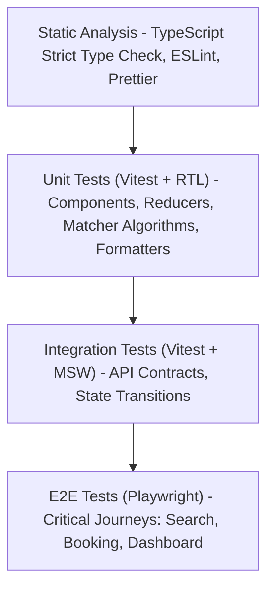

# Testing Strategy — SkillConnect

| Document Attribute | Details |
| :--- | :--- |
| **Document ID** | `DOC-OPS-003` |
| **Status** | Approved |
| **Owner** | Lead QA Engineer & Testing Architect |
| **Target Audience** | QA Engineers, All Developers, DevOps |
| **Last Updated** | October 2026 |

---

## 1. Testing Pyramid & Automation Framework

SkillConnect employs a multi-tiered automated testing pyramid ensuring high test fidelity and rapid developer feedback:

---

## 2. Testing Levels and Framework Selection

| Testing Tier | Framework / Tool | Scope & Responsibilities | Coverage Target |
| :--- | :--- | :--- | :--- |
| **Static Checks** | TypeScript (`tsc --noEmit`), ESLint | Syntax, type errors, React hook rules, unused variables | 100% passing |
| **Unit Testing** | Vitest + React Testing Library | Pure functions, formatters, search normalization, UI components | `>= 80%` |
| **Integration** | Vitest + Mock Service Worker (MSW) | API endpoint handlers, booking state machine transitions | `>= 85%` |
| **End-to-End (E2E)**| Playwright | Full browser journeys (Chrome, Safari, Mobile viewport) | 100% of P0 flows |
| **Accessibility** | axe-core + Playwright A11y | WCAG 2.1 AA automated auditing, contrast checks, keyboard traps| 0 AA violations |

---

## 3. Critical Test Scenarios & Journey Matrix

### 3.1 Search & Filter Engine
* Verify query normalization (case-insensitive, whitespace trim).
* Verify category chip selection updates results list correctly.
* Verify combining filters (e.g., "Plumbing" + "Rating 4.5+" + "Available Today") returns accurate intersections.
* Verify "Clear All Filters" restores initial candidate pool.

### 3.2 Multi-Step Booking Wizard
* Step 1: Submitting empty issue description triggers field error; valid description enables "Continue".
* Step 2: Selecting past date or disabled slot is prevented; valid slot selection enables "Continue".
* Step 3: Displays diagnostic fee and indicative labor breakdown accurately.
* Step 4: Submission creates deterministic reference code, saves record in `localStorage`, and displays confirmation disclaimer.

### 3.3 Worker Availability Toggle
* Clicking switch updates visual state immediately (Green vs Gray).
* Triggers accessible toast confirmation.
* Directory reflects updated status without full page reload.

---

## 4. Related Documentation
* [Quality and Acceptance Checklist](file:///06-QUALITY-ACCEPTANCE-CHECKLIST.md)
* [Accessibility Requirements](file:///docs/design/ACCESSIBILITY-REQUIREMENTS.md)
* [CI/CD and Deployment Plan](file:///docs/operations/CI-CD-AND-DEPLOYMENT-PLAN.md)
