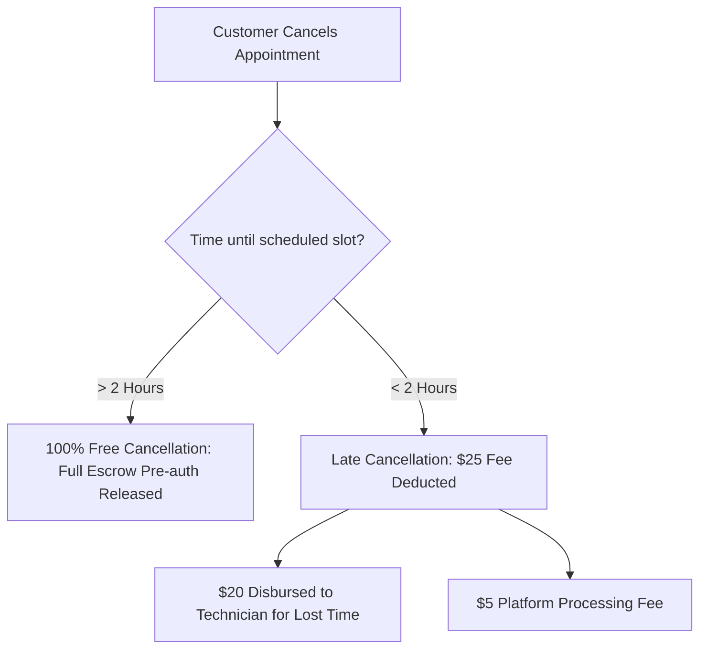

# Cancellation, Refund, and Dispute Policy — SkillConnect

| Document Attribute | Details |
| :--- | :--- |
| **Document ID** | `DOC-POL-004` |
| **Status** | Approved |
| **Owner** | Operations & Customer Success Lead |
| **Target Audience** | Support Agents, Finance, Customers, Service Professionals |
| **Last Updated** | October 2026 |

---

## 1. Cancellation Policy

SkillConnect enforces clear cancellation windows to protect technician scheduling while offering reasonable customer flexibility:

### 1.1 Customer Cancellation Windows
* **Free Window (>= 2 hours prior to scheduled start)**: Customer incurs zero charges. Pre-authorization hold is released immediately.
* **Late Window (< 2 hours prior to scheduled start)**: A standard **$25.00 late fee** is captured from pre-authorization. $20.00 is disbursed to the technician to compensate for wasted vehicle travel scheduling, and $5.00 is retained for platform processing.
* **Customer No-Show**: If technician arrives on-site and customer is unreachable for 15 minutes, full **Diagnostic Fee ($65.00)** is charged and disbursed to technician.

### 1.2 Technician Cancellation
* If a technician cancels a confirmed job, the customer is refunded 100% immediately and awarded a **$15 platform credit** toward an alternative technician.
* Technicians with > 2 cancellations per month face automated ranking demotions and potential account suspension.

---

## 2. Refund and Dispute Resolution

### 2.1 48-Hour Inspection Escrow Guarantee
* Customer funds remain secured in Stripe escrow for **48 hours** following job completion.
* If work is unsatisfactory, customer clicks "Report Issue / Dispute" within the 48-hour window. This immediately pauses payout release.

### 2.2 Dispute Resolution Protocol
1. **Mediation**: Support agent contacts both parties to review photos and invoices.
2. **Remediation Option**: Technician is given first right of refusal to return and fix defective work at no extra charge.
3. **Escalation & Refund**: If technician refuses or work caused damage, platform issues partial or full refund from escrow and opens insurance claim under SkillConnect Property Guarantee.

---

## 3. Related Documentation
* [Payments, Commissions, and Refunds](file:///docs/architecture/PAYMENTS-COMMISSIONS-AND-REFUNDS.md)
* [Admin and Support Playbook](file:///docs/operations/ADMIN-AND-SUPPORT-PLAYBOOK.md)
* [Terms of Service Requirements](file:///docs/policies/TERMS-OF-SERVICE-REQUIREMENTS.md)
