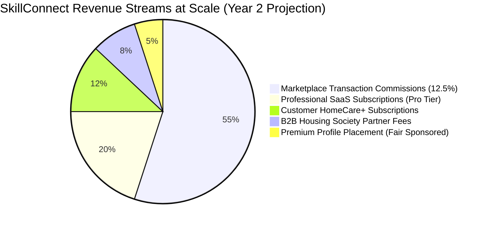
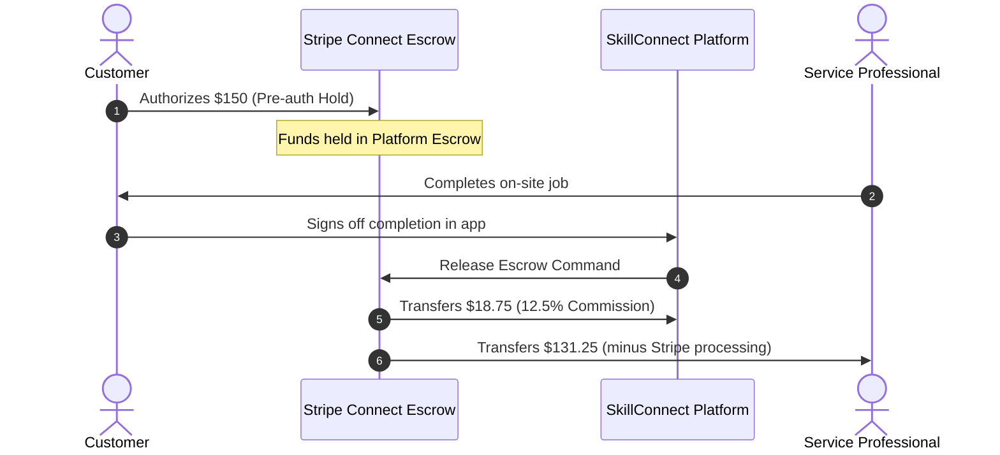

# Business Model and Revenue Architecture — SkillConnect

| Document Attribute | Details |
| :--- | :--- |
| **Document ID** | `DOC-PROD-009` |
| **Status** | Approved |
| **Owner** | Chief Commercial Officer & Product Strategy |
| **Target Audience** | Executive Leadership, Finance, Product Managers, Architects |
| **Last Updated** | October 2026 |

---

## 1. Monetization Strategy Overview

SkillConnect employs a diversified, multi-sided monetization model that avoids predatory lead-generation fees and aligns platform revenue directly with completed, successful transactions.

---

## 2. Core Revenue Mechanisms

### 2.1 Transaction Commissions (Take Rate)
* **Mechanic**: SkillConnect deducts an automated marketplace commission upon successful customer completion and fund release.
* **Rate Structure**:
  * **Standard Take Rate**: **12.5%** of gross labor and inspection fees (parts/materials are passed through at 0% markup to ensure price honesty).
  * **Pro Subscription Tier**: Reduced commission of **8.5%** for professionals subscribed to SkillConnect Pro.
* **Commission Calculation Formula**:
  $$\text{Platform Commission} = (\text{Diagnostic Fee} + \text{Labor Total}) \times \text{Commission Rate}$$
  $$\text{Worker Disbursed Amount} = (\text{Total Invoice}) - \text{Platform Commission} - \text{Stripe Processing Fee (2.9% + \$0.30)}$$

### 2.2 Standard Diagnostic / Inspection Fee
* To protect technicians from frivolous calls, every scheduled booking includes an upfront diagnostic inspection fee ($49 – $89 depending on category and market).
* **Credit Against Repair**: If the customer approves the technician's on-site estimate and proceeds with the repair, the diagnostic fee is credited 100% towards the total labor bill.
* **Inspection Only**: If the customer declines the repair quote, the diagnostic fee is retained by the technician (minus platform commission) to compensate for travel time and expert evaluation.

### 2.3 Professional SaaS Subscriptions ("SkillConnect Pro")
* **Price**: $39 / month or $390 / year.
* **Value Entitlements**:
  * Reduced commission rate (8.5% instead of 12.5%).
  * Advanced scheduling and automated customer review collection.
  * Verified "Pro Member" badge on directory card.
  * Priority listing placement in rotation within certified categories.
  * Monthly business analytics report (quote conversion rate, revenue trends, customer lifetime value).

### 2.4 Customer Membership ("HomeCare+ Club")
* **Price**: $14.99 / month or $149 / year.
* **Value Entitlements**:
  * Zero platform booking service fees ($0 booking fee on all jobs).
  * 10% discount on all standard diagnostic inspection fees.
  * 1 free annual multi-point home safety check (plumbing, electrical, and HVAC inspection).
  * Extended 90-day platform craftsmanship warranty (standard is 30 days).

### 2.5 B2B Housing Society & Commercial Facility Partnerships
* **Contract Structure**: Recurring annual management fee ($1,200 – $4,800/yr per property) + negotiated volume commission (10%).
* **Value Delivered**: Centralized facility dashboard, dedicated preferred technician dispatch, SLA guarantee (under 2 hours for urgent leaks/outages), and consolidated monthly AP invoicing.

---

## 3. Financial Flow & Escrow Mechanics

---

## 4. Refund & Cancellation Economics

| Cancellation Scenario | Customer Charge | Worker Compensation | Platform Retention |
| :--- | :--- | :--- | :--- |
| **Customer cancels > 2h prior** | $0.00 (Full release) | $0.00 | $0.00 |
| **Customer cancels < 2h prior** | $25.00 late fee | $20.00 travel allowance | $5.00 processing |
| **Customer No-Show (Pro on-site)** | Diagnostic Fee ($65) | Diagnostic Fee minus fee | Standard 12.5% |
| **Worker cancels or No-Show** | $0.00 + $15 platform credit | $0.00 + Account strike | $0.00 |

---

## 5. Related Documentation
* [Product Vision](file:///docs/product/PRODUCT-VISION.md)
* [Payments, Commissions, and Refunds Architecture](file:///docs/architecture/PAYMENTS-COMMISSIONS-AND-REFUNDS.md)
* [Cancellation, Refund, and Dispute Policy](file:///docs/policies/CANCELLATION-REFUND-AND-DISPUTE-POLICY.md)
