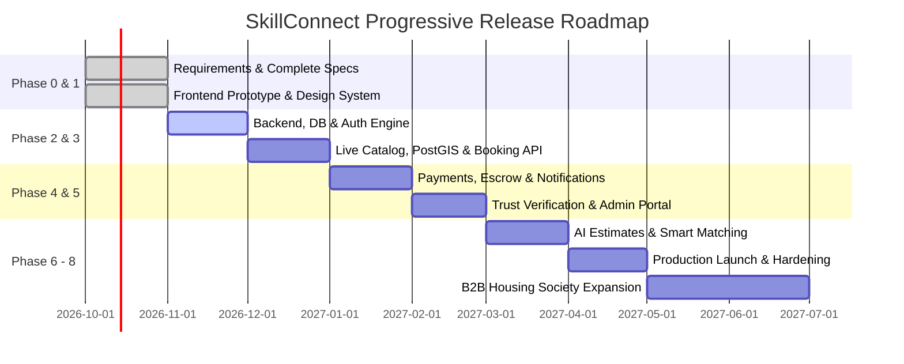

# MVP and Release Roadmap — SkillConnect

| Document Attribute | Details |
| :--- | :--- |
| **Document ID** | `DOC-PROD-008` |
| **Status** | Approved |
| **Owner** | Program Delivery & Engineering Management |
| **Target Audience** | All Stakeholders, Engineering Teams, Executive Sponsors |
| **Last Updated** | October 2026 |

---

## 1. Multi-Phase Roadmap Overview

The delivery of **SkillConnect** is phased incrementally to de-risk technical, operational, and commercial assumptions while delivering high customer value at every stage.

---

## 2. Phase Breakdown and Exit Criteria

### Phase 0: Architecture & Documentation Baseline (CURRENT)
* **Goal**: Establish the definitive, comprehensive architecture and specifications before writing production application code.
* **Deliverables**: Complete 54-document Markdown specification system covering Product, UI/UX, Technical Architecture, Security, Policies, Operations, and Project Management.
* **Exit Gate**: All documentation reviewed, cross-referenced, verified with 0 dead links, and approved by project stakeholders.

### Phase 1: Frontend Prototype & Interaction Experience
* **Goal**: Build a pixel-perfect, responsive Next.js App Router prototype verifying usability, design aesthetics, and user flows.
* **Deliverables**: Public pages (`/`, `/services`, `/professionals`, `/professionals/[slug]`), interactive booking modal with step validation, customer/worker dashboards, and rich mock data.
* **Exit Gate**: Zero console errors, fully responsive down to 360px, keyboard accessible, WCAG AA compliant.

### Phase 2: Core Backend, Database & Authentication
* **Goal**: Implement persistent data store and secure identity management.
* **Deliverables**: PostgreSQL schema migration (Prisma/Kysely), NextAuth / Clerk authentication with RBAC, secure session handling, user registration endpoints.
* **Exit Gate**: Automated integration test coverage >80% for authentication flows; zero OWASP Top 10 vulnerabilities.

### Phase 3: Live Services Directory & Booking Engine
* **Goal**: Connect frontend to real catalog data with geospatial search and booking lifecycle state machine.
* **Deliverables**: PostGIS location search, slot reservation engine with 15-minute lock TTL, booking state machine with state transition safety.
* **Exit Gate**: Stress test sustaining 200 concurrent booking reservations without double-booking collisions.

### Phase 4: Financial Transactions, Escrow & Notifications
* **Goal**: Commercial enablement via secure payment authorization and customer notifications.
* **Deliverables**: Stripe Connect integration, two-step payment hold/capture, automated commission splits, Twilio SMS and Resend transactional emails.
* **Exit Gate**: Successful end-to-end sandbox settlement of customer pre-authorization, technician payout, and platform fee deduction.

### Phase 5: Verification Workflows, Moderation & Admin
* **Goal**: Operational integrity and platform quality control.
* **Deliverables**: Stripe Identity / Persona integration for trade license checks, administrative dispute dashboard, review moderation queue.
* **Exit Gate**: Compliance review approval of audit logging and privacy handling for government documents.

### Phase 6: AI-Assisted Price Estimation & Smart Matching
* **Goal**: Reduce price anxiety via automated image and description scoping.
* **Deliverables**: Multimodal LLM integration (Google Gemini / OpenAI Vision) generating estimated labor hours and parts costs with prominent disclaimers.
* **Exit Gate**: AI estimates benchmarked against 500 historic trade jobs with error envelope within ±20% for standard tasks.

### Phase 7: Security Audit, Hardening & Public Launch
* **Goal**: Production readiness in initial metro market (e.g., San Francisco Bay Area or Austin, TX).
* **Deliverables**: Third-party penetration testing, disaster recovery rehearsal, SLA monitoring setup (Datadog/Sentry).
* **Exit Gate**: Production sign-off, SOC 2 Type 1 readiness, zero Sev-1 or Sev-2 security defects.

### Phase 8: Enterprise Partnerships & Advanced Capabilities
* **Goal**: Scale into multi-unit housing societies and commercial property management.
* **Deliverables**: B2B partner billing portal, corporate SLA reporting, bulk dispatch API.

---

## 3. Related Documentation
* [Feature Priority Matrix](file:///docs/product/FEATURE-PRIORITY-MATRIX.md)
* [Implementation Plan](file:///docs/project/IMPLEMENTATION-PLAN.md)
* [Dependency and Delivery Plan](file:///docs/project/DEPENDENCY-AND-DELIVERY-PLAN.md)
