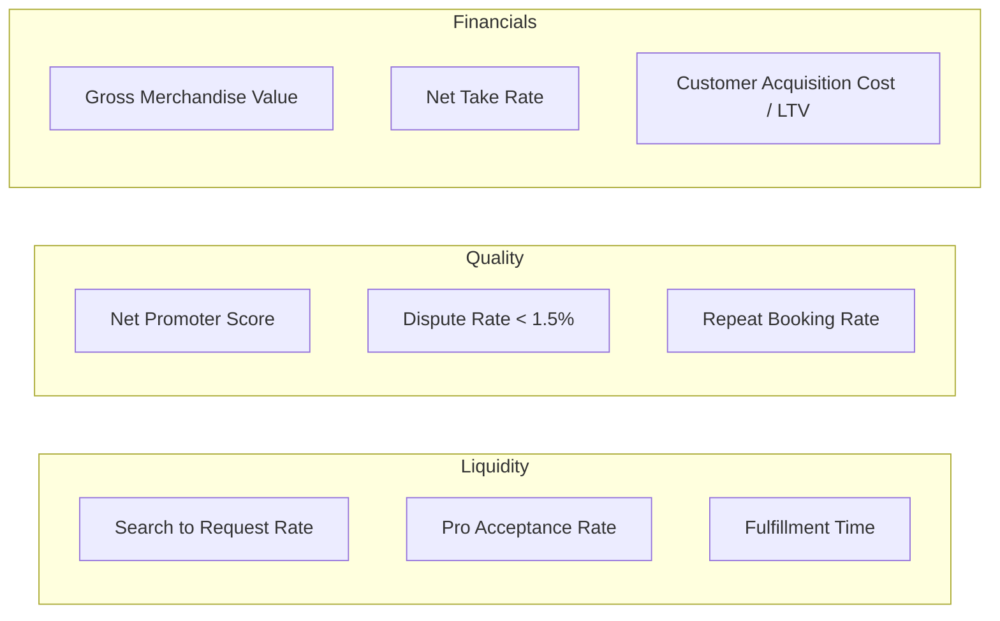

# Product Metrics & KPIs — SkillConnect

| Document Attribute | Details |
| :--- | :--- |
| **Document ID** | `DOC-PROD-010` |
| **Status** | Approved |
| **Owner** | Product Analytics & Operations Lead |
| **Target Audience** | Executive Leadership, Growth Teams, Product Managers |
| **Last Updated** | October 2026 |

---

## 1. Metrics Framework

SkillConnect evaluates platform health across four core vectors:
1. **Marketplace Liquidity & Fulfillment**
2. **Customer Conversion & Booking Funnel**
3. **Service Quality & Trust Integrity**
4. **Unit Economics & Financial Sustainability**

---

## 2. Key Performance Indicators (KPIs) & Target Benchmarks

| Metric Name | Calculation / Definition | Baseline / Target (Year 1) | Monitoring Frequency |
| :--- | :--- | :--- | :--- |
| **Search-to-Booking Conversion** | $\frac{\text{Completed Bookings}}{\text{Unique Search Sessions}}$ | $\ge 4.5\%$ | Daily |
| **Pro Acceptance Rate** | $\frac{\text{Accepted Job Requests}}{\text{Total Dispatched Requests}}$ | $\ge 82\%$ | Daily |
| **Median Response Time** | Elapsed minutes from customer request to worker acceptance | $\le 12 \text{ minutes}$ | Real-time |
| **Booking Fulfillment Rate** | $\frac{\text{Completed Jobs with Sign-Off}}{\text{Total Confirmed Bookings}}$ | $\ge 93\%$ | Weekly |
| **Customer Dispute Rate** | $\frac{\text{Bookings with Opened Dispute}}{\text{Total Completed Bookings}}$ | $\le 1.2\%$ | Weekly |
| **Gross Merchandise Value (GMV)** | Sum of all completed transactions (Labor + Fees + Materials) | Tracking Target | Monthly |
| **Net Marketplace Take Rate** | $\frac{\text{Platform Net Commission Revenue}}{\text{Total Labor & Inspection GMV}}$ | $11.5\% - 12.5\%$ | Monthly |
| **30-Day Repeat Booking Rate** | % of customers booking a second service within 30 days | $\ge 22\%$ | Monthly |
| **Worker Monthly Churn** | % of active service professionals lapsing activity > 30 days | $\le 3.5\%$ | Monthly |
| **Net Promoter Score (NPS)** | Customer satisfaction post-completion survey (-100 to +100) | $\ge +60$ | Continuous |

---

## 3. Funnel Drop-Off Tracking & Instrument Events

To diagnose UX friction, the analytics pipeline (PostHog/Segment) must capture:
* `event_view_landing`: User visits `/`.
* `event_search_query`: User executes search with category and location.
* `event_view_profile`: User opens `/professionals/[slug]`.
* `event_start_booking`: User clicks "Book Appointment".
* `event_booking_step_complete`: Logged for Step 1 (Scope), Step 2 (Schedule), Step 3 (Review).
* `event_booking_confirmed`: Customer submits hold authorization.
* `event_job_completed`: Customer signs off job.

---

## 4. Related Documentation
* [Product Vision](file:///docs/product/PRODUCT-VISION.md)
* [Business Model and Revenue](file:///docs/product/BUSINESS-MODEL-AND-REVENUE.md)
* [Testing Strategy](file:///docs/operations/TESTING-STRATEGY.md)
