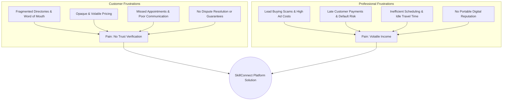

# Product Vision — SkillConnect

| Document Attribute | Details |
| :--- | :--- |
| **Document ID** | `DOC-PROD-001` |
| **Status** | Approved (Baseline) |
| **Owner** | Product Management / Strategy |
| **Target Audience** | Executive Leadership, Product Managers, UI/UX Designers, System Architects |
| **Last Updated** | October 2026 |

---

## 1. Executive Summary

**SkillConnect** is a next-generation local services marketplace designed to bridge the trust and efficiency gap between homeowners/businesses and local trade service professionals (electricians, plumbers, carpenters, HVAC technicians, cleaners, painters, appliance repair technicians).

### Tagline
> **Find trusted help. Book confidently. Get the job done.**

Modern consumers face fragmented classifieds, unverified claims, opaque pricing, and unreliable communication when hiring local service professionals. Simultaneously, skilled technicians struggle with marketing overhead, erratic lead generation, delayed customer payments, and lack of verified digital reputation management.

SkillConnect solves this two-sided dilemma by providing:
1. **Curated, Verified Discovery**: Multi-tier identity, background, and trade skill verification.
2. **Transparent, Dynamic Pricing**: Upfront price ranges, standardized diagnostic fees, and transparent AI-assisted estimates.
3. **Structured Booking Lifecycle**: Real-time availability, clear milestones, automated notifications, escrow-like payment protection, and verified mutual reviews.
4. **Professional Enablement**: Digital business management tools for tradespeople, turning independent solo workers into reputable, high-earning service providers.

---

## 2. Problem Statement & Opportunity

### 2.1 The Customer Problem
* **Trust Deficit**: Customers invite strangers into their homes with little assurance regarding identity, skill competence, or criminal background.
* **Price Anxiety**: Customers fear bait-and-switch pricing or predatory quotes once work has begun.
* **Friction and Delay**: Calling multiple technicians to negotiate availability results in significant scheduling frustration.
* **Lack of Recourse**: Poor craftsmanship or incomplete work leaves customers with zero institutional dispute protection.

### 2.2 The Professional Problem
* **Predatory Lead Fees**: Existing lead aggregators charge technicians upfront simply to contact a lead, regardless of conversion.
* **Operational Inefficiencies**: Tradespeople spend 20–30% of their working hours fielding calls, quoting, invoicing, and chasing late invoices instead of billable labor.
* **Geographic Dispersal**: Route planning is unoptimized, leading to excessive travel time and vehicle fuel costs.
* **Lack of Verified Credibility**: Skilled craftspeople are lumped in with low-quality operators on unmoderated forums.

---

## 3. Core Value Proposition

| Stakeholder | Core Value Proposition | Key Enablers |
| :--- | :--- | :--- |
| **Customers** | Effortless, dependable booking of vetted local professionals with upfront pricing and service guarantees. | Verified profiles, upfront price breakdowns, AI estimates, real-time tracking, customer support. |
| **Service Professionals** | Consistent, local, high-conversion bookings with guaranteed on-time payout and portable reputation. | Direct job dispatch, zero upfront lead buying fees, automated invoicing, schedule management. |
| **Housing Societies / B2B Partners** | Standardized, vetted facility maintenance support with centralized invoicing and compliance. | Partner portals, bulk service contracts, compliance auditing, SLA adherence. |
| **Platform Ecosystem** | Sustainable, trust-anchored marketplace generating revenue via commissions, subscriptions, and partner services. | Fair marketplace take-rates, pro software subscriptions, transparent warranties. |

---

## 4. Brand Identity & Design Principles

* **Capable & Capacious**: The platform evokes mastery, craftsmanship, and technical competence.
* **Transparent & Reassuring**: Clear pricing, explicit prototype labels, upfront inspection costs, and no hidden platform fees.
* **Human-Centric & Dignified**: Service professionals are represented as skilled, valued business operators, not fungible gig workers.
* **Locally Rooted**: Prioritizes neighborhood density, reducing travel times and fostering community trust.

---

## 5. Strategic Differentiators

1. **Zero Pay-Per-Lead Extortion**: Unlike legacy platforms (e.g., Angi, Thumbtack) where workers pay upfront for non-converting leads, SkillConnect operates on a performance-based model: small commission on completed work or optional SaaS workflow subscriptions.
2. **AI-Assisted Scoping & Estimating**: Utilizes structured image and diagnostic inputs to provide preliminary cost envelopes, setting customer expectations prior to worker arrival.
3. **Escrow-Style Milestone Protection**: Funds are authorized upon booking and released upon verified customer job sign-off, protecting workers from non-payment and customers from incomplete work.
4. **Dual Reputation Matrix**: Mutual rating system where customers rate craftsmanship, punctuality, and cleanliness, while technicians rate safety, prompt payment, and job site readiness.

---

## 6. Assumptions & Strategic Hypotheses

* **Assumption 1**: Customers are willing to pay a modest service fee (or standard diagnostic fee) in exchange for vetted safety, punctuality, and platform dispute guarantees.
* **Assumption 2**: Skilled professionals will adopt platform scheduling tools if it eliminates the burden of lead-buying and payment collections.
* **Assumption 3**: Hyperlocal clustering (concentrating supply in specific postal codes/neighborhoods) is required to maintain acceptable technician response times under 60 minutes.

---

## 7. Open Questions & Future Explorations

* [ ] Should instant emergency dispatch (under 45 minutes) be offered in Phase 3 or deferred to Phase 8?
* [ ] What insurance partner integration will provide standard $50,000 property damage guarantees on certified jobs?
* [ ] How will trade certification verification vary across international and municipal jurisdictions?

---

## 8. Related Documentation
* [Product Requirements](file:///docs/product/PRODUCT-REQUIREMENTS.md)
* [Business Model and Revenue](file:///docs/product/BUSINESS-MODEL-AND-REVENUE.md)
* [MVP and Release Roadmap](file:///docs/product/MVP-AND-RELEASE-ROADMAP.md)
* [System Architecture](file:///docs/architecture/SYSTEM-ARCHITECTURE.md)
