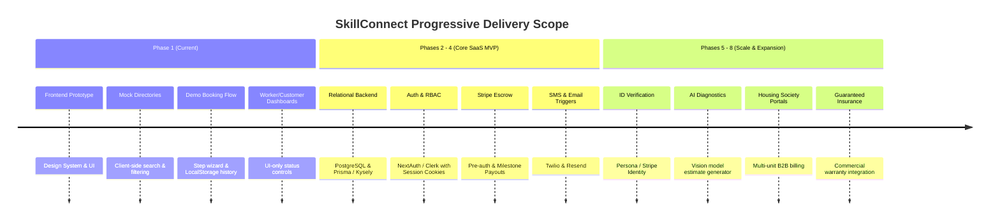

# Project Scope and Non-Goals — SkillConnect

| Document Attribute | Details |
| :--- | :--- |
| **Document ID** | `DOC-PROD-003` |
| **Status** | Approved |
| **Owner** | Program Management / Technical Governance |
| **Target Audience** | All Engineering Teams, Product Owners, External Auditors |
| **Last Updated** | October 2026 |

---

## 1. Purpose & Boundary Principles

To maintain velocity, engineering discipline, and clear stakeholder alignment, this document establishes the explicit functional and operational boundaries of **SkillConnect**. It strictly defines what is in-scope for Phase 1 (Frontend Demonstration), the production MVP (Phases 2–4), and what constitutes an explicit **Non-Goal**.

---

## 2. Phase-by-Phase Scope Boundaries

### 2.1 In-Scope: Phase 1 (Frontend Demonstration Prototype)
* Complete visual brand identity and responsive UI design system (Tailwind CSS, clean typography, responsive layout).
* Public discovery routes: Home (`/`), Services Directory (`/services`), Professional Directory (`/professionals`), Individual Professional Profile (`/professionals/[slug]`).
* Search and filtering engine executed client-side against rich, realistic mock datasets.
* Multi-step interactive booking modal/drawer with validation, sample price breakdown, and deterministic confirmation references.
* Interactive demo dashboards for Customer (`/customer/dashboard`) and Professional (`/worker/dashboard`) with availability toggles and job acceptance simulation.
* Frontend-only Login (`/login`) and Register (`/register`) forms with client-side field validation, demo toasts, and no password persistence.
* Accessible components, keyboard navigability, reduced-motion compatibility, and graceful 404 handler (`not-found.tsx`).

### 2.2 In-Scope: Phase 2–4 (Core Production SaaS MVP)
* Production PostgreSQL database with ACID transaction safety and geospatial search extensions (PostGIS).
* Secure user authentication, session token handling, password hashing (Argon2id/Bcrypt), and Role-Based Access Control (RBAC).
* Real-time booking state engine with conflict resolution and automated appointment reminders (Email/SMS).
* Payment processing via Stripe Connect (Split payments, platform take-rate, automated technician payouts upon customer milestone sign-off).
* Genuine professional onboarding with document upload to secure private S3 buckets.

### 2.3 Explicit Non-Goals (Out of Scope for Initial Production Release)

The following capabilities are deliberately excluded to prevent scope creep:

| Non-Goal Item | Detailed Rationale & Deferred Phase |
| :--- | :--- |
| **Real-time GPS Tracking** | Continuous vehicle tracking (like Uber/Lyft) adds severe battery and infrastructure costs with minimal value for scheduled home trade visits. Geostamped arrival check-in is sufficient. (Deferred to Phase 8). |
| **In-App Video Consultations** | WebRTC video streaming between homeowner and technician introduces heavy media server costs. High-res photo uploads with issue descriptions satisfy 98% of preliminary scoping needs. (Deferred to Phase 8). |
| **Automated Trade Licensing Auditing via Government APIs** | Municipal and state licensing bodies lack unified, automated verification APIs. Manual document verification by compliance staff is required initially. |
| **Cryptocurrency or Direct Cash Settlement** | Untraceable settlement destroys platform accountability, disintermediates fee collection, and invalidates property damage guarantees. All transactions must pass through platform escrow. |
| **Multi-Tenant Enterprise White-Labeling** | SkillConnect is a unified consumer and B2B marketplace brand, not a white-label software vendor for other marketplace operators. |
| **Guaranteed 15-Minute Emergency Dispatch** | Emergency trade dispatch requires dedicated full-time emergency fleets. SkillConnect focuses on scheduled same-day and next-day appointment windows. |

---

## 3. Prototype Honesty and Anti-Deception Guarantees

In compliance with consumer protection standards and engineering ethics:
1. **No Fake Verifications**: In Phase 1 mock interfaces, badges labeled "Verified Professional" must include tooltips or subtitle notes clarifying: *"Sample verification badge for prototype demonstration."*
2. **No Fake Identity Assurance**: The system shall never assert that mock profiles have passed criminal background checks.
3. **No Phantom Bookings**: Booking confirmation screens must plainly display: *"Demonstration Notice: This is a frontend simulation. No actual technician has been dispatched and no charges have been incurred."*
4. **Zero Credential Persistence**: In demo authentication flows, passwords entered by users must be discarded immediately from memory and never written to `localStorage`, `sessionStorage`, or console logs.

---

## 4. Related Documentation
* [Product Vision](file:///docs/product/PRODUCT-VISION.md)
* [Feature Priority Matrix](file:///docs/product/FEATURE-PRIORITY-MATRIX.md)
* [MVP and Release Roadmap](file:///docs/product/MVP-AND-RELEASE-ROADMAP.md)
* [Threat Model and Risk Assessment](file:///docs/security/THREAT-MODEL-AND-RISK-ASSESSMENT.md)
