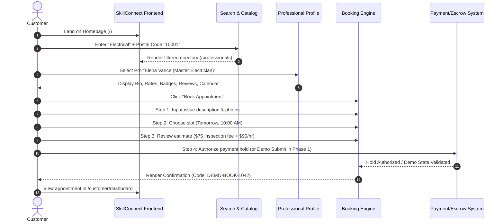
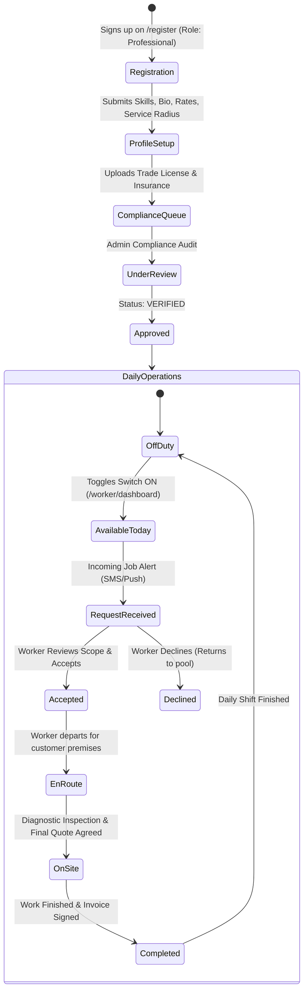

# User Journeys — SkillConnect

| Document Attribute | Details |
| :--- | :--- |
| **Document ID** | `DOC-PROD-006` |
| **Status** | Approved |
| **Owner** | UI/UX Architecture & Product Strategy |
| **Target Audience** | Frontend Engineers, Designers, Product Managers |
| **Last Updated** | October 2026 |

---

## 1. Primary Customer Journey: Discovery to Confirmed Booking

---

## 2. Professional Onboarding & Daily Operational Journey

---

## 3. Exception & Dispute Resolution Journeys

### 3.1 Customer Cancellation Journey
1. **Initiation**: Customer navigates to `/customer/dashboard` -> Active Bookings -> Clicks "Cancel Appointment".
2. **Policy Verification**: System checks cancellation timestamp against appointment start time:
   * **> 2 Hours Prior**: Cancellation is free. Escrow payment pre-authorization is instantly released.
   * **< 2 Hours Prior**: Standard late cancellation fee ($25) charged; balance released. Fee disbursed to technician for wasted scheduling slot.
3. **Audit & Confirmation**: Booking status updated to `CANCELLED`; confirmation email dispatched.

### 3.2 Technician Dispute or Damage Escalation
1. **Trigger**: Customer reports damaged property or incomplete service via "Report Issue" in Dashboard within 48 hours of service completion.
2. **Escrow Freeze**: Automatic release of escrow funds to technician is paused immediately.
3. **Evidence Submission**:
   * Customer submits photos of defective work/damage.
   * Professional submits before-and-after work photos and signed paper/digital job ticket.
4. **Resolution by Support**: Support agent investigates within 24 hours. Outcomes include:
   * Re-dispatch of master technician to correct issue at platform expense.
   * Partial or full customer refund.
   * Payout release to technician if claim is found fraudulent.

---

## 4. Related Documentation
* [User Stories and Acceptance Criteria](file:///docs/product/USER-STORIES-AND-ACCEPTANCE-CRITERIA.md)
* [Route and Page Inventory](file:///docs/design/ROUTE-AND-PAGE-INVENTORY.md)
* [Booking Lifecycle and Business Rules](file:///docs/architecture/BOOKING-LIFECYCLE-AND-BUSINESS-RULES.md)
* [Cancellation, Refund, and Dispute Policy](file:///docs/policies/CANCELLATION-REFUND-AND-DISPUTE-POLICY.md)
