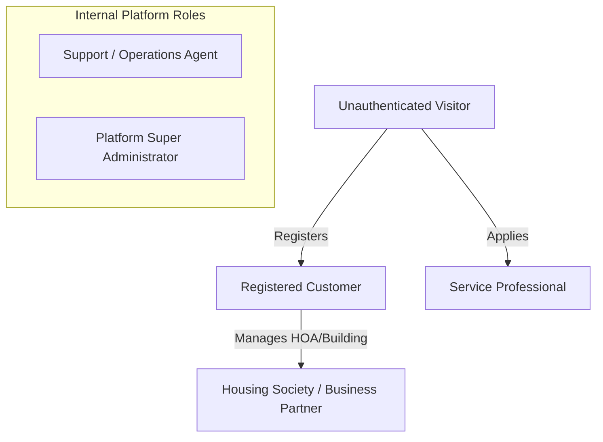

# User Personas and Roles — SkillConnect

| Document Attribute | Details |
| :--- | :--- |
| **Document ID** | `DOC-PROD-004` |
| **Status** | Approved |
| **Owner** | Product Design & UX Research |
| **Target Audience** | Designers, Product Managers, Engineers, Security Specialists |
| **Last Updated** | October 2026 |

---

## 1. System Roles Hierarchy

SkillConnect enforces a strict Role-Based Access Control (RBAC) model across six primary user types:

---

## 2. Detailed User Roles & Access Rights

### 2.1 Unauthenticated Visitor (Guest)
* **Description**: Any public user browsing the web application without an active session.
* **Permissions**:
  * View landing page, category taxonomy, public service guides, and FAQ.
  * Search and filter directory of approved service professionals.
  * View public professional profiles, ratings, badges, and sanitized customer review comments.
  * Test prototype booking flow (in demo mode) or initiate real registration.
* **Restrictions**:
  * Cannot confirm real bookings.
  * Cannot access direct contact information (phone number, exact address) of professionals.
  * Cannot post reviews or submit ratings.

### 2.2 Registered Customer
* **Persona Archetype: "Sarah Jenkins" — Busy Working Parent & Homeowner**
  * *Context*: 38 years old, owns a suburban townhome, needs reliable emergency and routine home repairs without wasting time calling 10 contractors.
  * *Pain Points*: Contractors who don't show up, surprise bills at completion, safety anxiety when letting strangers inside.
* **Permissions**:
  * Create, reschedule, and cancel bookings.
  * View live status of booked technicians (dispatched, en-route, arrived, completed).
  * Save favorite service professionals for repeat dispatch.
  * Securely authorize payment holds and approve milestone payouts.
  * Submit verified customer reviews following completed jobs.
  * Raise dispute or support tickets for unsatisfactory craftsmanship.
* **Restrictions**:
  * Cannot access professional's personal home address or internal platform notes.
  * Cannot bypass platform escrow to pay off-platform.

### 2.3 Service Professional
* **Persona Archetype: "Marcus Vance" — Master Plumber & Independent Contractor**
  * *Context*: 44 years old, licensed master plumber with 16 years of experience, runs a 2-person van operation.
  * *Pain Points*: Spends nights sending quotes and billing, hates paying for junk leads on Angi/Yelp, hates chasing unpaid invoices.
* **Permissions**:
  * Manage business profile (skills, trade certificates, photos of past work, service radius).
  * Configure custom pricing, hourly rates, and standard diagnostic/inspection fees.
  * Set availability calendar (regular hours, instant "Available Today" toggle, vacation blackout).
  * Accept, decline, or propose alternative times for incoming job requests.
  * Update on-site job status (En Route, Arrived, Scope Finalized, Job Complete).
  * Trigger final invoice with optional itemized parts and extra labor.
  * Rate customer (safety, accurate job description, payment promptness).
* **Restrictions**:
  * Cannot modify verified badge status independently.
  * Cannot receive direct payouts until banking (Stripe Connect KYC) and identity verification are approved.
  * Cannot contact customer after 7 days post-job completion.

### 2.4 Platform Administrator
* **Role Summary**: High-privilege platform operator responsible for system integrity, compliance, and configuration.
* **Permissions**:
  * Global CRUD over service categories, base platform fees, and pricing rules.
  * Approve or reject professional verification applications (licenses, insurance, background checks).
  * Suspend, ban, or reinstate user accounts (Customer or Professional).
  * View platform-wide revenue analytics, transaction ledgers, and dispute queues.
  * Override booking states in escalated dispute arbitrations.
* **Restrictions**:
  * Cannot access plaintext user passwords or unmasked payment card credentials.
  * All privileged administrative actions are logged in an immutable audit ledger (`audit_logs`).

### 2.5 Support & Moderation Agent
* **Role Summary**: Tier 1 and Tier 2 customer service representatives handling booking issues, cancellations, and disputes.
* **Permissions**:
  * View sanitized booking history, customer-technician messaging logs, and uploaded job photos.
  * Facilitate customer refunds within authorized threshold (up to $250 without manager escalation).
  * Moderate flagged reviews and profile descriptions for offensive language or policy violations.
* **Restrictions**:
  * No access to system configuration, financial commission rates, or administrative database credentials.

### 2.6 Housing Society / Business Partner (B2B)
* **Persona Archetype: "Elena Rostova" — Residential Community Facility Manager**
  * *Context*: Manages a 240-unit condominium complex, requires ongoing plumbing, electrical, and HVAC maintenance with unified monthly invoicing.
* **Permissions**:
  * Bulk dispatch requests across multiple units.
  * Consolidated monthly invoicing and corporate expense reporting.
  * Access to dedicated preferred contractor pool with pre-vetted background checks.
* **Restrictions**:
  * Cannot access private personal resident account details beyond unit number and authorized repair scope.

---

## 3. Related Documentation
* [User Stories and Acceptance Criteria](file:///docs/product/USER-STORIES-AND-ACCEPTANCE-CRITERIA.md)
* [User Journeys](file:///docs/product/USER-JOURNEYS.md)
* [Role Permission Matrix](file:///docs/security/ROLE-PERMISSION-MATRIX.md)
* [Admin and Support Playbook](file:///docs/operations/ADMIN-AND-SUPPORT-PLAYBOOK.md)
