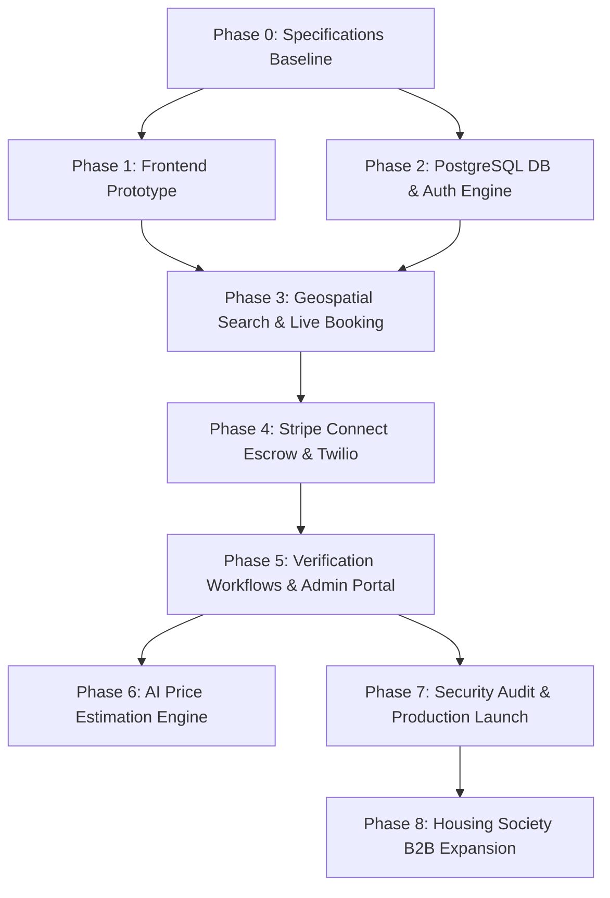

# Dependency and Delivery Plan — SkillConnect

| Document Attribute | Details |
| :--- | :--- |
| **Document ID** | `DOC-PROJ-002` |
| **Status** | Approved |
| **Owner** | Technical Program Manager |
| **Target Audience** | Engineering Leads, Project Managers, Executive Sponsors |
| **Last Updated** | October 2026 |

---

## 1. Architectural Dependency Graph

---

## 2. Critical Path Analysis

The critical delivery path for SkillConnect follows:
$$\text{Phase 0 (Specs)} \longrightarrow \text{Phase 2 (DB/Auth)} \longrightarrow \text{Phase 3 (Booking Engine)} \longrightarrow \text{Phase 4 (Stripe Escrow)} \longrightarrow \text{Phase 7 (Launch)}$$

* **Primary Bottleneck**: Stripe Connect Express onboarding & KYC compliance approval. Merchant account setup must be initiated at the onset of Phase 2 to avoid blocking Phase 4 end-to-end payment testing.
* **Secondary Bottleneck**: Municipal trade licensing databases lack uniform APIs; manual audit SOPs in Phase 5 require trained compliance personnel before onboarding public technicians.

---

## 3. Milestones & Delivery Schedule

| Milestone Code | Description | Dependencies | Target Completion | Exit Verification |
| :--- | :--- | :--- | :--- | :--- |
| `MS-0` | Complete 54-Document Specification System | None | October 2026 | 0 Dead links, 100% review sign-off |
| `MS-1` | Responsive Frontend Prototype Live | `MS-0` | November 2026 | Zero console errors, fully responsive |
| `MS-2` | Database & Secure Authentication Live | `MS-0` | December 2026 | Automated auth tests > 80% passing |
| `MS-3` | End-to-End Live Booking & Search Active | `MS-1`, `MS-2` | January 2027 | Concurrency stress test: 200 users |
| `MS-4` | Escrow Payments & SMS Alerts Live | `MS-3` | February 2027 | Stripe test settlement successful |
| `MS-5` | Technician Verification & Admin Live | `MS-4` | March 2027 | Compliance audit queue operational |
| `MS-6` | Metro Public Beta Launch | `MS-5` | May 2027 | Zero Sev-1/Sev-2 security issues |

---

## 4. Related Documentation
* [Master Implementation Plan](file:///docs/project/IMPLEMENTATION-PLAN.md)
* [MVP and Release Roadmap](file:///docs/product/MVP-AND-RELEASE-ROADMAP.md)
* [Risks, Assumptions, and Open Questions](file:///docs/project/RISKS-ASSUMPTIONS-AND-OPEN-QUESTIONS.md)
