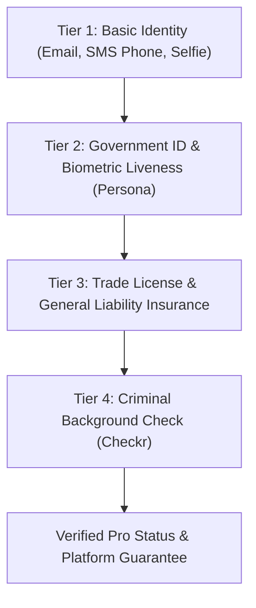

# Identity and Skill Verification — SkillConnect

| Document Attribute | Details |
| :--- | :--- |
| **Document ID** | `DOC-SEC-005` |
| **Status** | Approved |
| **Owner** | Head of Trust, Safety & Compliance |
| **Target Audience** | Operations, Compliance Officers, Backend Developers, UI Designers |
| **Last Updated** | October 2026 |

---

## 1. Multi-Tier Verification Framework

SkillConnect establishes trust through a progressive, multi-tier vetting pipeline for service professionals:

---

## 2. Verification Levels and Requirements

| Level | Verification Scope | Verification Provider | Valid Period | Display Badge |
| :--- | :--- | :--- | :--- | :--- |
| **Level 1** | Phone (SMS OTP) + Email | Twilio / Internal | Indefinite | None (Internal flag) |
| **Level 2** | Government Photo ID (Driver's License/Passport) + Selfie Liveness | Persona / Stripe Identity | 2 Years | "ID Verified" |
| **Level 3** | Municipal/State Trade License + General Liability ($1M minimum) | Compliance Audit Queue | 1 Year (Annual renewal) | "Licensed & Insured" |
| **Level 4** | County & Federal Criminal Background Screening | Checkr API | 1 Year (Annual re-run) | "Background Checked" |

---

## 3. Verification States & Lifecycle

* `UNVERIFIED`: Initial account created; cannot accept bookings.
* `PENDING_REVIEW`: Documents submitted to compliance queue; estimated 24–48h review.
* `VERIFIED`: All required tiers passed; full profile live in directory with badges.
* `REJECTED`: Fails background or fraudulent license detected; account barred.
* `EXPIRED`: Annual insurance certificate lapsed; technician given 14-day grace period before badge suppression.

---

## 4. Prototype Display Rules & Ethical Standards

* **Ethical Guardrail**: In Phase 1 demonstration mode, badges displayed on mock cards must explicitly clarify their demonstration status.
* **Component Disclaimer**: The `VerifiedBadge` component must render a subtle tooltip or subtitle stating:
  > *"Sample verification badge for demonstration prototype."*
* Under no circumstances shall the platform claim that mock profiles have undergone real police checks.

---

## 5. Related Documentation
* [Security Requirements](file:///docs/security/SECURITY-REQUIREMENTS.md)
* [Threat Model and Risk Assessment](file:///docs/security/THREAT-MODEL-AND-RISK-ASSESSMENT.md)
* [Safety and Acceptable Use Policy](file:///docs/policies/SAFETY-AND-ACCEPTABLE-USE.md)
