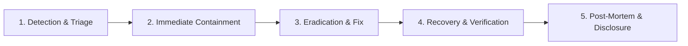

# Security Incident Response Plan — SkillConnect

| Document Attribute | Details |
| :--- | :--- |
| **Document ID** | `DOC-SEC-006` |
| **Status** | Approved |
| **Owner** | Chief Information Security Officer (CISO) |
| **Target Audience** | Security Engineers, DevOps, On-Call Responders, Executive Leadership |
| **Last Updated** | October 2026 |

---

## 1. Incident Severity Classification

| Severity Level | Definition & Criteria | Target Response Time | Incident Lead |
| :--- | :--- | :--- | :--- |
| **SEV-1 (Critical)** | Active customer PII breach, database compromise, remote code execution (RCE), payment escrow theft. | `< 15 minutes` | CISO / VP Engineering |
| **SEV-2 (High)** | Authentication bypass, privilege escalation, widespread API failure, unmasked addresses leaking. | `< 60 minutes` | Lead Security Architect |
| **SEV-3 (Moderate)** | Rate-limiting bypass, non-sensitive credential stuffing attempts, intermittent webhook failure. | `< 4 hours` | On-Call Lead Engineer |
| **SEV-4 (Low)** | Minor dependency CVE without exploitability, cosmetic security header discrepancy. | `< 24 hours` | DevOps / AppSec Engineer |

---

## 2. Five-Stage Incident Lifecycle

### Stage 1: Detection & Triage
* Alerts triggered via Datadog, AWS CloudTrail anomaly alerts, Sentry, or third-party vulnerability disclosures.
* On-call engineer initiates incident war room on Slack (`#incident-sevX`) and dedicated video bridge.

### Stage 2: Immediate Containment
* Revocation of compromised API tokens or database service credentials.
* Isolation of impacted Next.js server instances or Cloudflare IP range blocks.
* Temporary maintenance mode flag triggered if data integrity is actively threatened.

### Stage 3: Eradication
* Root cause identification (e.g., SQL injection, exposed S3 bucket policy, vulnerable npm package).
* Emergency patch deployed through rapid hotfix CI/CD pipeline.

### Stage 4: Recovery
* Re-verification of all system integrity checks and database audit logs.
* Gradual restoration of traffic with continuous monitoring.

### Stage 5: Post-Mortem & Regulatory Notification
* **GDPR 72-Hour Rule**: If personal customer or technician data has been compromised, notify relevant Data Protection Authorities (DPA) within 72 hours of awareness.
* Conduct blameless retrospective within 5 business days and publish internal root-cause analysis (RCA).

---

## 3. Related Documentation
* [Security Requirements](file:///docs/security/SECURITY-REQUIREMENTS.md)
* [Threat Model and Risk Assessment](file:///docs/security/THREAT-MODEL-AND-RISK-ASSESSMENT.md)
* [Disaster Recovery and Business Continuity](file:///docs/operations/DISASTER-RECOVERY-AND-BUSINESS-CONTINUITY.md)
